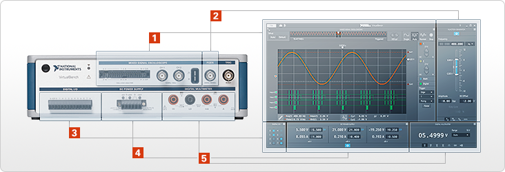

ELEC 243 Lab

------------------------------------------------------------------------

VirtualBench
============

The National Instruments VirtualBench is five instruments in one
device:  

- Mixed-Signal Oscilloscope With Protocol Analysis
- Digital Multimeter
- Function Generator
- Programmable DC Power Supply
- Digital I/O

The digital I/O will not be used in 241 lab, and we will use a handheld
multimeter, at least in the beginning of the lab. But VirtualBench
essentially replaces three devices in the lab - the oscilloscope, the
function generator, and the power supply. VirtualBench can also connect
wirelessly and be used on an iPad, instead of the lab computers. The
digital interface of VirtualBench allows for more exact measurements and
customizable settings, as well as an easy way to get screenshots of the
oscilloscope.

Click [here](http://www.ni.com/virtualbench/specifications/) for
specifications, and click [here](http://www.ni.com/virtualbench/try/) to
view video tutorials.
