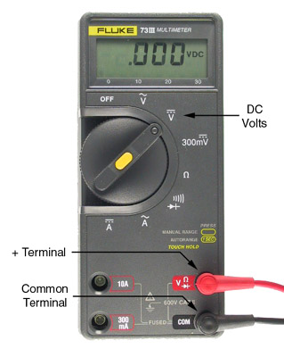
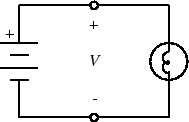
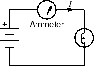
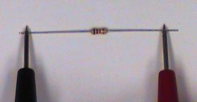
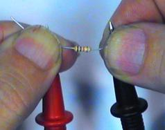
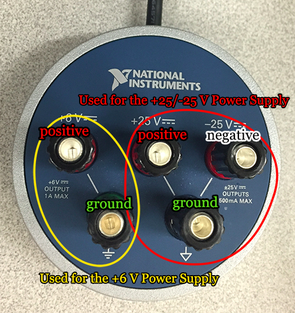
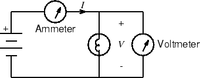

ELEC 243 Lab

------------------------------------------------------------------------

Experiment 1.1
--------------

DC Measurements: the DMM
------------------------

### Equipment

-   [Battery Pack and Batteries](../misc_images/#batt-pack)
-   [Lightbulb Socket Board](../misc_images/#lamp-board)
-   Digital Multimeter
-   Banana Plug Patch Cords

### Part A: Measuring Voltage with the DMM

1. Turn on the digital multimeter (DMM) to the setting for DC volts
   measurement:  

2. Make sure the negative (black) lead is plugged into the COM terminal and the
   positive (red) lead is plugged into the V terminal, as shown in the picture.
   COM stands for common, or in other words, the termin al that is the point of
   reference for other terminals.

3. **Measure the voltage of each battery** by holding the positive probe
   against the top of the battery and the negative probe against the bottom.

    !!! note
        In measuring voltage, we are always measuring the *difference in potential*
        between two nodes. So the meter is always connected across two points.

4. Place the two batteries into the holder in the orientation indicated.
   **Measure the voltage of the battery pack. It should be equal to the sum of
   the two batteries. Is it?**

    !!! warning
        Be careful not to short the two leads of the battery pack together once the
        batteries are installed. To be safe, remove at least one of the batteries when
        the pack is not in use.

5. Wire the circuit below by screwing the leads from the battery pack to L and
   R terminals of the lamp board. The bulb should light (though rather dimly).
   **Measure the battery voltage again. Is it the same as before?**

   

    
   

### Part B: Measuring Current with the DMM

To measure current, we must connect the meter *in series* with the
circuit we are measuring, as in the figure below. This is because
current flows *through* a conductor, whereas voltage appears *across*
two conductors.

This is because current flows *through* a conductor, whereas voltage
appears *across* pairs of conductors.

1. With the meter disconnected from the circuit, set the function switch to DC
   current ("A" with straight solid and dashed lines above it). Move the red
   meter lead to the 300 mA terminal.

    !!! warning
        An ammeter must always be connected in series. Connecting an ammeter in
        parallel with a circuit element can pass very large currents through the
        ammeter, blowing its internal fuse or damaging it. A good practice is to always
        reset the DMM to voltage measurement settings after making a current
        measurement.

2. Use the NC ('not connected') terminal as a node to connect the positive
   battery terminal to the positive lead of the DMM.

- **Note the current value displayed on the DMM.**

### Part C: Measuring Resistance with the DMM

1. Set the DMM to Ohms (W) and return the positive meter lead to Volts/Ohms
   terminal. Touch the two probes together. The meter should read zero
   resistance. If it reads more than a few tenths of an ohm, check for poor
   connections or have your meter serviced.

2. Select several resistors at random from your parts kit. For each resistor,
   determine its nominal value from the [color code](../references/color_code),
   then measure its resistance by touching one probe to each lead of the
   resistor. **Do the nominal and measured values agree?**

    !!! note
        To read a 4-band resistor color code, view it with the gold/silver band
        to the right. The first two band colors correspond to the first two
        digits of the resistor value and the third band color is the
        multiplier.  The fourth band is the percent tolerance. Tolerance means
        that the actual resistance value is guaranteed to be within the marked
        value specified percent.

    !!! note 
        To measure resistance, lay the resistor on the bench and test as shown
        below.

    

    
    
  

3. **What's wrong with holding the leads and probes between your fingers?** 

    

    
    

4. The actual resistance $R$ of a resistor having nominal values $R_0$ and
   tolerance $d$ lies in the range $R_0(1+d)$. **What is the tolerance of a series
   connection of two such resistors? Of a parallel connection?**

5. Obtain ten resistors with the same marked value. Measure the resistance of
   each resistor. **Does your batch have the stated accuracy?**

6. Holding one DMM lead in each hand, measure your own resistance. The reading
   may be unstable, therefore the resolution is limited to the digit that
   changes least often. **What is the value and resolution of your
   resistance?**

7. **Does your resistance change when you wet your fingers? If so, speculate
   why. What voltage would be necessary to produce a 5mA current through you?**
   (Why 5mA? Read [Safety](../safety)).

8. Using the DMM, **measure the resistance of the light bulb. Does this
   correspond to the value you would expect from Ohm's Law given the values of
   voltage and current you measured in Parts A and B?**

    !!! warning
        The DMM can only measure the resistance of an element when it is
        disconnected from the circuit. Remember to turn off the power source or
        the value measured will be inaccurate.

### Part D: Measuring the I-V Characteristics of the Light Bulb

An ideal resistor obeys Ohm's law: $I=V/R$, i.e. the current through the
element is proportional to the voltage across it. But for most real materials,
the resistance changes as the temperature changes, and clearly, the temperature
of the light bulb's filament increases as more current flows through it. Let's
find out how the current and voltage of our light bulb are related.

For this measurement, we will need to vary the voltage applied to the bulb, so
we will need a variable voltage source. This is provided by the DC Power Supply
on the VirtualBench. The DC power supply actually contains two variable voltage
sources, but we will be using only one of them, the $0-6V$ supply.

1. Make sure the DC power dongle is attached to your VirtualBench (VB).

    

    
    

2. Set the DMM to DC Volts. Connect the black (-) probe to the black $0-6V$
   output terminal and the red (+) probe to the red terminal.

3. Press the power button on the power supply interface below the oscilloscope
   screen. Gradually increase the output voltage by raising the voltage in the
   $+6V$ setting. Both the power supply and the DMM should show increasing
   voltage values. For several different values, note both the power supply $+6V$
   setting and the DMM reading. **How do the two compare?** Return the voltage
   output to zero.

    !!! note
        For the rest of this part, you will need to use VirtualBench as your
        second DMM. To use the DMM feature of VirtualBench, plug in the leads
        to the digital multimeter feature of VirtualBench. Note that
        VirtualBench contains two pairs of sockets for the leads: the left
        socket pair can be used for measuring voltage and resistance, while the
        right socket pair can be used for measuring current.

        

        
        

4. Wire the circuit below. You will need [banana plug patch
   cords](../misc_images/#banana-plug-patch-cords) for this.

    

    
    

5. Measure the current for voltages between $0V$ and $1V$, in steps of about $0.2
   V$. and between $1V$ and $5V$ in steps of about $0.5 V$. It is not necessary to
   have $V$ exactly equal to $1.000, 1.500,$ etc. Just get it close and write down
   the numbers accurately.

6. **Plot $I$ as a function of $V$. [How?](./plotting-help/)**

7. **To what point on this curve does the value of resistance you measured with
   the ohmmeter correspond?**

8. Now generate a $I$ vs. $V$ curve for a $1000$-ohm resistor
   (brown-black-red). You can use the NC and L binding posts to hold the
   resistor for this measurement. **Is our assumption that $I=V/R$ for all $V$
   a valid one?**

9. When finished, turn off the DMM.
