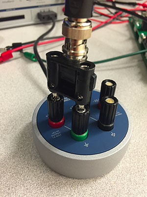

ELEC 243 Lab

------------------------------------------------------------------------

Experiment 1.2
--------------

The Oscilloscope and Function Generator
---------------------------------------

### Equipment

* BNC Patch Cords

So far we've measured only constant (or nearly constant) voltages and currents.
A much more interesting class of signals are *time varying* voltages and
currents. For a slowly time varying signal, we could just write down the values
as they change (as we did in plotting the light bulb I-V curve), but for most
time varying signals we need something a bit faster. On the VirtualBench, that
would be the *oscilloscope*.

In order to measure time varying signals, we need a source of time varying
signals. The DC power supply on the VirtualBench is our source of constant
voltages, and the *function generator* is our source for that class of time
varying signals known as *periodic signals*.

### Part A: Viewing Signals with the Oscilloscope

First get acquainted with the settings of the oscilloscope, even though
you will continue using many of them in their default setting. Make sure
you are being consistent in using either `CH 1` or `2`.

!!! note
    Make sure the oscilloscope controls are as follows:

    * Time/Div: 1ms
    * Mode: Auto
    * Display: CH 1
    * Volts/Div: 2V
    * AC-DC: DC
    * Trigger: Edge; CH 1; Rising

!!! note
    If everything is in order, you should see a red horizontal line through the
    middle of the screen.

1. Set up the function generator to produce a 1kHz sine wave (found to the
   right of the oscilloscope display). Turn on the power button for the
   function generator. Set it as follows:

    * Frequency: 1.0 kHz
    * Amplitude 3 Vpp (Volts, peak-to-peak)
    * DC Offset: 0 V
    * Duty Cycle (only used for square wave setting)
    * Function: Sine wave

2. Connect the function generator's `OUTPUT` to the oscilloscope's `CH 1` input.
   The easiest way to do this is to connect one end of a BNC patch cord to the
   function generator `FGEN` and the other to the oscilloscope `CH`

3. This connects the generator's ground and signal terminals to the scope's
   ground and terminals. If all has gone well, you should see 6 full cycles of
   a sine wave in red.

4. Now examine the effect of each control:

    * Move the display with the positioning controls - click and drag the
      toolbar at the top.

    * Change the Time/Div and Volts/Div settings to see what effects are
      produced.

    * Click on the ruler in the bottom left of the screen and change the
      settings of the function generator to observe how the oscilloscope
      automatically measures signal features such as frequency, period, and
      amplitude.

    * **Why do you think these numbers are slightly different from the function
      generator settings?**

5. Examine the various waveforms produced by the function generator.  Examine
   the effects of the `DUTY CYCLE` and `DC OFFSET` controls. Before going on, be
   certain that you are comfortable with the oscilloscope and function
   generator. If you are having problems, ask your labbie for help.

### Part B: Quantitative Measurements with the Oscilloscope

In addition to allowing us to view the "shape" of a signal, the oscilloscope
can also measure voltage, amplitude, time intervals, and frequency.

1. Connect the oscilloscope `CH 2` input to the $0-6V$ output of the DC power
   supply. For this you can use a BNC patch cord and your [BNC to banana
   plug adapter](../misc_images/#banana-adapter). 
   
    

    
    

2. Switch to `CH 2` and under Channel Settings, set the vertical offset to 0.
   This effectively sets the reference to $0$, known as "zeroing" the signal.

3. Increase the voltage to $2V$. Continue to increase the voltage and see how
   well the scope readings and power supply settings agree.

4. **Why would we want to use the oscilloscope to measure a "DC" voltage?**

5. Switch to `CH 1` and "zero" Channel 1 as above. Set the function generator
   to produce a 2kHz sine wave. Set the `TIME/DIV` setting to $100 \mu s$.
   Measure the distance between two successive zero crossings of the same slope
   and multiply by the Time / Div factor to get the *period* of the waveform.
   Using the formula $f=1/T$, determine the measured frequency of the signal.
   **How does this compare with the nominal frequency?**

    !!! note
        There are several ways we can express the amplitude of a signal. For the
        sine wave $y(t)=Asin(2πft)$ the amplitude A is equal to the distance from the
        positive (or negative) peaks of the waveform to the t-axis.  This peak
        amplitude measurement is equally useful for any waveform which has equal
        positive and negative peaks.

        Arbitrary waveforms may not have this property, so a more general
        measurement is the peak-to-peak amplitude, the distance between the
        positive and negative peaks of the signal.

        Other measures of a signal's magnitude include average and rms, which we'll
        talk about later. Since in general these different measures have different
        values, it is a good idea always to specify which amplitude measurement you
        are using.

6. We can also use the oscilloscope to measure the *amplitude* of a signal.
   Disconnect your oscilloscope from the function generator and use a BNC clip
   lead to connect `CH 1` to the square wave and ground outputs of the scope,
   located to the right of the `CH 2` input socket.

7. **Sketch this signal's waveform.** What is its period? What is its
   frequency? Adjust the CH 1 Volts/Div switch so that the waveform nearly
   fills the screen vertically. Measure the peak-to-peak amplitude by counting
   the number of divisions between the upper and lower peaks and multiplying by
   the Volts/Div factor. Does your measurement of the waveform's amplitude
   correspond to the VB's measurement? (Click on the ruler button to look at
   the signal's measurements.)

8. **Take a screenshot of the waveform** by going to File $\rightarrow$ Export Screenshot
