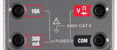
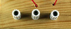
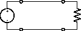
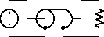

ELEC 240 Lab

------------------------------------------------------------------------

Interlude
---------

Grounds and Grounding
---------------------

Since a voltage is actually a *difference* in potential, it is always measured
*between* two points in the circuit. In most circuits there is a single point
(actually many physical points tied together by low resistance conductors into
a single electrical point) with respect to which all other voltages are
expressed. This point is called the "common", "reference", or "ground" node.
The term "ground" arises from the fact that in the early days of telegraphy,
one leg of the circuit was formed by the earth itself by driving a conductive
rod into the ground at each of the two stations so that only a single wire was
required between them.

In our circuits, we will actually use a wire, rather than dirt, to form the
ground connection, but we must bear in mind that all of our ground terminals
are connected together (sometimes without our doing so explicitly). This
concept of a common ground terminal becomes important when we look at our next
two instruments, the Function Generator and the Oscilloscope.

So far most of the the instruments and components we've used have had
their terminals connected to banana jacks. For example:

| instrument | image |
| ---------- | ----- |
| power supply |  
| DMM |  |
| lamp breadboard |  |

The function generator and 'scope don't have banana jacks. Instead they have
what are called "BNC" connectors. These are a type of *coaxial* connector where
the outer (ground) conductor surrounds the inner (signal) conductor. So instead
of:  

we have:  

This type of connection has a number of advantages. The shielding by the outer
conductor reduces interference *to* low level signals and *by* high level ones.
The single connector allows both terminals to be connected simultaneously.

The (sometime) disadvantage is that the outer (shield or ground) conductors of
*all* the BNC connectors on *all* our instruments are connected together.
Within one instrument they are connected together by the metal chassis. Since
the chassis is connected to the third (ground) terminal of the power cord, the
chassis (and hence the grounds) of all the instruments are connected together.
Later we'll see how this can be a disadvantage. For now, let's avail ourselves
of some of the advantages.
