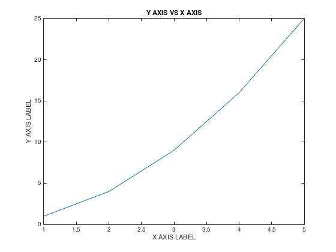

### ELEC 243 Lab 

# Plotting X vs. Y 

One way to plot one variable versus another is with the `Plot()` function of
Matlab. Begin by opening up Matlab on the desktop, and entering the data in as
vectors. Note that Matlab plots in the order that the points are given, so be
careful that each value in the $x$ and $y$ vector corresponds with the next
point. 

```matlab 
x=[1 2 3 4 5]; 
y=[1 4 9 16 25];
plot(x,y);
``` 

Of course, it would be useful to title the plots. This can be
done in Matlab with the following lines:  
```matlab 
title('Y AXIS VS X AXIS')
xlabel('X AXIS LABEL') 
ylabel('Y AXIS LABEL')
```  

Note that you can do $\LaTeX$ Style subscripts using underscores in Plot
Titles.  Once you're done naming the plots, save them by clicking "file" and
then "save as". Make sure to save as a JPG. Example plot:  

<center>

</center>
