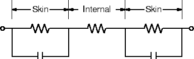

# Safety

First the bad news:

### Electricity can kill you.

How? The two most common ways are:  

* by cooking you (the hard way)
* by disrupting your nervous system (the easy way)

The good news is that in ELEC 240 laboratory, you will not be exposed to
dangerous voltage levels *unless* you mishandle the equipment. Before we get
close enough to the equipment to mishandle it, let's take a closer look at just
how you can get hurt if you do.

### What strength voltages and currents are harmful?

Electricity is potentially the most dangerous commodity in general use by the
public today. In spite of this, less than 1 percent of the 100,000 accidental
deaths which occur annually in the United States are directly attributable to
electrocution. Considering the ever-increasing use of electricity in the home
and industry, we should be alert to protect and better this excellent safety
record. An understanding of the effects of electric shock, high-frequency
heating, and other electrically produced physiological phenomena on the human
body should be part of basic knowledge. We present a brief survey of these
topics in the hope that you will become aware of the very real dangers inherent
in the application of electrical phenomena. We shall consider these dangers in
each frequency band of the electromagnetic spectrum - from the power
frequencies to cosmic rays.

#### Power Frequencies

**Electric Shock.** The ratio of fatalities to injuries for electric shock
accidents is very high in comparison to the corresponding figure for all other
accidents. *Death due to electric shock is fast and permanent.*

**Shock Sensitivity.** Because of a person's highly developed nervous system,
they are sensitive to very small currents. For example, the tongue will give a
sensation of taste at currents as low as 45 microamperes. The threshold of
feeling on the hand is found to be on the order of 5 mA DC and 1 mA at 60 Hz.
The shocks due to currents at this threshold are usually considered annoying
rather than dangerous.  However, they are startling when not anticipated, and
may cause involuntary movement that sometimes results in serious injury. As the
value of current increases above the threshold, one becomes aware of sensations
of heat and contraction of the muscles. Sensations of pain develop and
voluntary control of the muscles in the path of the current becomes
increasingly difficult. Finally a value of current is reached where the victim
"freezes" to the circuit. The value of current at which a victim can just
release the electrode is referred to as "let-go" current. The average let-go
current for healthy people is about 16 mA rms (60 Hz). It is important to note
that let-go currents of as low as 5 mA have been measured. Experience has shown
that an individual can withstand, with no ill aftereffect except for possible
sore muscles, repeated exposure to their let-go current for at least the time
required for them to release the conductor.

**Effect of Frequency and Waveform.** Gradually increasing direct current
produces sensations of internal heating. Sudden changes of current, however,
produce powerful muscular contractions, and interruption of the current causes
very severe shocks. Experiments at 10 kHz indicate that the let-go current is
approximately 3 times the 60 Hz value. For non-sinusoidal waveforms, the peak
value seems to be the critical factor in muscular stimulation.

**Nature of Bodily Damage.** As far as gross electrical effects are concerned,
the body can be represented by the equivalent circuit shown in the figure
below.

The outer skin (epidermis) is roughly 0.1 mm thick and has a resistance of the
order of $10^5 \Omega cm^2$ when dry. The inner skin (dermis)
and the internal organs are of relatively low resistance because of their high
salinity. It is generally believed that the effects of electric shock are due
to the current flowing through the body. Electrical burns are a result of
heating the skin. The immediate formation of blisters at the point of contact
causes the skin to lose its protective resistance and more serious damage may
thus occur. Burns of this nature penetrate quite deeply and, while they seldom
become infected, heal very slowly. Electrical current is most dangerous when
vital organs are in its path through the body. Current may cause stoppage of
breathing due to excessive contraction of the chest muscles.  Temporary
paralysis of respiration may also occur if the current produces a block in the
nervous system that prevents signals from reaching the lungs. In either case,
it is imperative that an approved form of artificial respiration be applied
immediately and continued without interruption until competent medical
examination has been made.

**Ventricular Fibrillation.** Passage of electrical current through the heart
is considered particularly dangerous. The heart exerts its pumping action as a
result of complex rhythmic motion controlled by periodic electrical impulses to
the muscle tissue. The regularity of this motion assures proper blood
circulation. Electric current passing through the heart completely upsets this
rhythmic motion and results in random muscular contractions. The heart no
longer effectively pumps, but quivers like so much "Jell-O". This condition is
known as ventricular fibrillation and is nearly always fatal. Energy of the
impulse of current is responsible for this hazard and an estimate of the danger
threshold for fibrillation is 13.5 watt-seconds.

#### Radio Frequencies

At frequencies above the power range, the primary bodily damage results from
dielectric heating. Heating also occurs from both conduction current and
radiation. The temperature of the human body is maintained remarkably constant
by very complex temperature regulating mechanisms.  These mechanisms,
coordinated by the brain, control temperature by regulating the production and
loss of heat. Circulation of bodily fluids contributes to the distribution of
the heat. The change in diameter of the blood vessels, for example, regulates
the volume and velocity of flow. However, not all areas are equally well
regulated, and it is possible for local heating to occur. Such local heating is
apt to be dangerous, particularly if vital organs are involved. A differential
of $5^\circ\text{C}$ maintained for a sufficient time may be injurious or even
lethal. Testes, for example, undergo degenerate changes with temperature rises
as low as $1^\circ\text{C}$. The amount of bodily temperature rise depends on
the specific area exposed and its efficiency of heat elimination. Other factors
contributing to temperature rise are intensity and the duration of exposure. At
frequencies below the microwave region $f < 1000MHz$, about 40 percent
of the incident energy is absorbed. These frequencies cause deep (internal)
heating and are very dangerous: such heating is not well indicated by sensory
elements of the skin.  A tolerance figure of $0.001\text{ watt cm}^2$ for
long-term exposures has been considered adequate. Surface burns resulting from
R.F. currents are similar to those encountered at lower frequencies.

#### Microwave Frequencies

The effects of the lower microwave frequencies are similar to those of radio
frequencies and a comparable tolerance figure for exposure should not be
exceeded. As the frequency increases $f > 3000MHz$, the incident energy
is absorbed by the skin with an efficiency of 40 to 50 percent. The effects of
such radiation are much the same as is encountered with infrared and sunlight.
The possibility of the formation of eye cataracts must be considered at
microwave frequencies. These cataracts result in impairment of vision or even
blindness as a result of the formation of a white cloud in the normally
transparent cornea of the eye. Cataracts are thought to occur in a manner
analogous to the formation of the "white" of an egg upon heating. Experiments
with rabbits have indicated that cataracts have formed in 3 to 9 days following
a single 15 minute exposure to a 100 watt source of 12 cm waves at a distance
of 5 cm.  While the exposure indicated here is probably extreme, care should be
taken when working with high-powered radar sets.

#### Infrared, Visible Light and Ultraviolet Frequencies

The immediate effects of this band of frequencies are popularly known as
sunburn. The eye, however, is particularly susceptible to excess exposure at
these frequencies. Such exposure can easily occur when observing an electric
arc without protection. This may result in hemorrhages of the choriod (the
outer lining of the retina) and actual destruction of portions of the retina
itself. In addition, actual immediate pain may be encountered because of
violent contractions induced in the iris. Photophthalmia (temporary snow
blindness) is due to ultraviolet radiation following undue exposure to
sunlight, an electric arc, or a sun lamp.

#### X-Rays and Nuclear Radiation

The effects of this portion of the electromagnetic spectrum of the human body
are still being studied. It has been found that the amount of energy absorbed
by the tissue during exposure is the most important consideration. Damage to
the reproductive organs has been found to be the most sensitive indication of
excessive exposure. Controlled experiments with mice exposed to fast neutron
radiation from an atomic reactor indicate the type of damage sustained by
living animals. During the first 9 months of continuous exposure, no visible
differences were noted. The mice then began to lose weight and gradually lose
hair. Eye cataracts developed after a year and death followed. Limited exposure
to nuclear radiation resulted in a shortened life span. We have yet to
completely determine the consequences of the atomic bombs of World War II in
terms of its biological effects. For this reason, plus the fact that the latent
period between exposure and detection of damage may run into months and years,
it behooves us to take all precautions against X-Ray and nuclear radiation.
