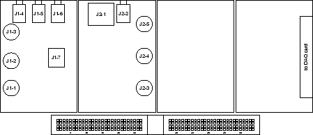

# Interlude

## The Breadboard

Most instruments have banana plugs or BNC connectors, so we can interconnect
them with patch cords. But as we begin to build our own circuits, we find that
many components have different kinds of connectors and most just have pieces of
wire coming out of them.

To connect a single component (or maybe two) to an instrument we can use the
BNC clip leads or alligator clips on the banana plug patch cords, But for
anything more complex, we need a scheme designed for connecting things with
pieces of wire. The system we will use goes by a number of names: solderless
breadboard, AP strip (after the original manufacturer), or proto-board. We will
simply call them "breadboards".

Our breadboards actually consist of two parts: the lower portion which is the
breadboard proper, and the upper part which contains the *interface modules*.

These are discussed in detail in the [Breadboard
section](../references/breadboard) of the Lab Station Handbook.

In either case, we make connections between one component and another by
pushing the ends of pieces of wire (possibly attached to a component) into the
holes in the breadboard. Although this is simple in concept, there is a bit of
art required to do it properly. See the [Wiring section](../references/wiring)
of the Lab Station Handbook for information on the art of wiring.

### The Interface Modules

The purpose of the Interface Modules is to bring signals from other parts of
the Lab Station to the breadboard for convenient wiring. To do this we must
connect those components to the Interface Modules via the appropriate cables.
Here is a drawing of the interface module with the names of the various
connectors.

There is a table of connector pin assignments in the [Interface
section](../references/interface/#pin-connections) of the Lab Station Handbook.

In the next experiment we will use the interface module to access the
oscilloscope and the function generator. To connect the oscilloscope, use a BNC
patch cord to connect `CH 1` of the scope to J1-1 of the Interface module.
Similarly, connect `CH 2` to J1-2.
