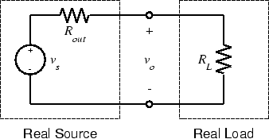
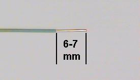
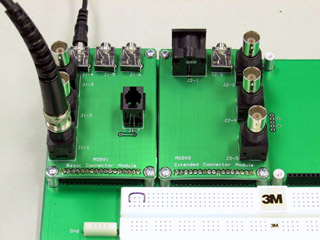

# Experiment 2.2

## Electroacoustic Transducers

### Components

* Loudspeaker
* Microphone

### Part A: Listening to a Signal

1. Set up the function generator to produce a 1kHz sine wave with a peak to
   peak (p-p) amplitude of 5 volts.

2. Using the [BNC clip leads](../misc_images/#bnc-cliplead), connect the output
   of the function generator to the speaker. **What do you hear?**

3. With the speaker still connected to the FGEN, measure the peak-to-peak
   voltage across the speaker. This time, connect an oscilloscope probe to one
   of the speaker leads. (The ground lead can remain disconnected because it is
   already internally connected to the FGEN ground). **What is the peak-to-peak
   measurement now? Why did it change?**

4. Using FGEN controls, vary the amplitude, frequency, and shape of the
   signal(i.e. sine, triangle, or square). **How does the nature of the sound
   change as these signal parameters change?**

5. Disconnect the speaker.

### Source Loading

If we consider the following circuit:

we can see what caused the reduction in signal amplitude (attenuation):
$R_{out}$ of the function generator and $R_L$ of the speaker form a voltage
divider. An ideal voltage source would have $R_{out}=0$ and there would be no
problem. However, any real source will have non-zero $R_{out}$. To reduce the
attenuation caused by loading, we can either reduce $R_{out}$ or increase
$R_L$. But, since $R_{out}$ and $R_L$] are actually parts of the source and
load respectively, that means we would have to replace either the source or the
load with a "better" one. If this is not feasible, we can isolate the source
from the load by placing an *amplifier* between them.

### Part B: Viewing an Acoustic Signal

The physical phenomenon behind the operation of the loudspeaker works in both
directions: in addition to converting an electrical signal into an acoustical
signal it can also convert sound to electricity. In techspeak we say that the
loudspeaker is a *bilateral* transducer.

1. Using the BNC clip leads, connect the speaker to `CH1` of the oscilloscope.

2. Set the `VOLTS/DIV` switch to `20 mV` and the `TIME/DIV` switch to `2 mSEC`.

3. Speak into the loudspeaker and observe the waveform on the oscilloscope. If
   necessary, adjust the oscilloscope to produce a satisfactory trace. **Note
   the amplitude of the signal.**

### Part C: Microphone

So far we have used an acoustic output device, the speaker, to convert
electrical signals to sound. Now we need an input device to convert acoustic
signals to electric ones.

1. Get a microphone from the supply room. It has two connectors: we will use
   the larger one.

    

    
    

2. Use a BNC patch cord to connect `CH1` of the scope to J1-1 of the test board
   (refer to the test board pin assignments).

3. Plug the microphone into J1-4 of the test board.

4. Take a piece of wire about 4 cm long and strip 6 to 7 mm of insulation from
   each end. The end of the wire should look like this:

    

    
    

    !!! note
        The stripped length of a wire is very important. If it is too short
        (less than 6 mm), insulation will be forced between the contact fingers
        of the socket strip, resulting in an intermittent connection (or none
        at all). This is the second most common cause of problems in the lab.
        If it is too long, the bare portion of the wire above the socket strip
        can short to other wires.

5. Plug one end of the wire to pin1 and the other end to pin 4. This will
   connect the microphone to the scope (CH1). The grounds are automatically
   connected by the test board.

    

    
    

6. Set the oscilloscope `V MODE` switch to `CH1`, the `CH 1 VOLTS/DIV` switch
   to `5 mV`, and the `TIME/DIV` switch to `1 mSEC`. - Set the other controls
   as required.

7. Speak, sing, or whistle into the microphone and observe the signal on the
   scope. If the amplitude is too small, you can use the *magnifier* to get a
   little more gain.

8. Produce a sustained vowel (a, e, i, o, u) sound. Sketch one or two of the
   more interesting waveshapes.

9. Continue producing a sustained vowel sound (inhaling as necessary) and
   measure its frequency (by measuring the period).

10. (optional) If you are musically inclined, sing (or whistle or hum) the note
    "A" and measure its frequency. How does your measured frequency compare
    with the "official" value for the frequency of A? Which do you trust to be
    more accurate, your sense of pitch or the oscilloscope?

11. Whistle into the microphone. (For this step, pitch is not important, so any
    note will do.) Observe the waveform on the oscilloscope. Is it sinusoidal?
