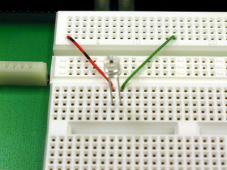
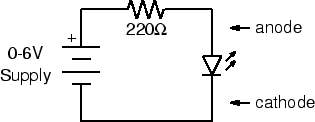
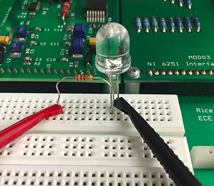
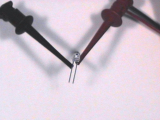

# Experiment 2.3

## Optoelectrical Signal Sources and Sinks

Since we will be building an optical communication system, we will need
some devices for converting electrical signals to and from light, as
well as to and from sound. We will look at two: the photodiode, which
converts light into an electrical signal, and the light emitting diode
(LED) which converts electric current to light.

### Equipment

* Photodiode
* Red LED

### Part A: The Photodiode

1. Connect the short lead (cathode) of the
   [photodiode](../misc_images/#photo-diode) to ground and the long lead
   (anode) to CH1 of the scope. You can use the BNC clip leads for this, but
   the better way (which leaves your hands free) is to the plug it into the
   breadboard and wire it to the appropriate interface pins (pin 1 to anode,
   pin 14 to cathode).
  
    

    
    

2. View the DC signal on the scope. **Note the voltage produced by photodiode.
   How does it change when you cover the photodiode with your hand?**

3. Set `CH1` to AC. What are the amplitude and frequency of the signal?

    !!! tip
        Click on the ruler by the bottom left corner of the oscilloscope view
        for helpful measurement tools.

4. Explain the waveform you observed in the previous step. Switch back to DC.

### Part B: Light Emitting Diode

1. Using a 220-ohm (red-red-brown) resistor and your [red
   LED](../misc_images/#red-led), wire the following circuit:

    

    
    

2. First wire the resistor and LED on the breadboard. There are two ways to
   connect the power supply to the circuit (use one or the other not both):

    * The first way: Plug your [BNC-banana
    adapter](../misc_images/#banana-adapter) into the $6V$ power supply
    terminals.  Note: There is a bump on one side of the adapter to denote
    which prong is connected to ground. Be sure to plug this prong into the
    black terminal of the power supply.

    

    
    

    Then use the clip leads to connect to the LED and resistor.

    

    
    

    * The other way: Use the BNC adapter as above, but use a BNC patch cord
    to connect the power supply to `J1-3`. Use two pieces of wire to connect
    ground (pin 14) to the LED and `J1-3` (pin 3) to the resistor.

3. Turn on the power supply. Slowly increase the voltage until you see the LED
   just begin to glow. Measure the voltage across the LED. If the LED doesn't
   light by the time the meter on the power supply reads 3 V, check your
   circuit to make sure the diode is wired in the correct orientation. Unlike a
   resistor or light bulb, the LED is *polarized.* The anode must be positive
   for it to glow. Reverse the LED and verify that this is the case.

4. Set the supply voltage to $3, 4$, and $5$ volts. At each step note the
   brightness of the LED and the voltage across it.

5. Next power the LED with the `FGEN` instead of the power supply. Set it to
   produce a $100$ Hz square wave with minimum amplitude.

6. Increase the amplitude until it begins to glow. Is the glow steady?

7. Slowly reduce the frequency of the `FGEN`. **At what frequency does noticeable
   flicker begin?**

8. **How does the number you measured in the previous step relate to the frame
   rate of television and motion pictures?**

### Part C: Optical Communication

1. Now connect the photodiode to `CH1` of the scope using a BNC-to clip leads
   cord.

    

    
    

2. With the LED still connected to the `FGEN` as in the previous part, set the
   frequency to $100$ Hz.

3. Hold the photodiode (pointing down) above the LED (pointing up).  Adjust
   their relative positions to maximize the signal displayed on the scope.

    !!! tip
        It may help to shield the components from ambient light with your hand.

4. **Describe the waveform. Is it what you would expect?**

5. Set the `FGEN` to produce a triangle wave. Take a screenshot of the waveform.
   **Is it what you expected?**

6. Reset the `FGEN` to produce a square wave. **What is the maximum distance
   over which you can transmit a recognizable signal?**

    !!! tip
        Switch to AC signal with higher gain.

7. We have several of the components needed for building an optical
   communication system. **What components are missing? What problems remain to
   be solved?**
