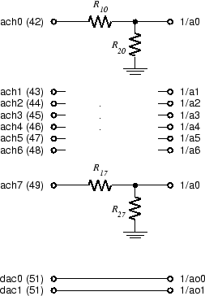

# Background

### Data Acquisition

The process of converting analog signals (e.g. voltages) to values in a
computer program is one of the core components of modern instrumentation and
communication systems. The other component is of course the computer itself,
where the data is processed and displayed or otherwise acted on.  This process
can also work in the opposite direction. The computer can calculate a desired
stimulus which can then be converted to an analog signal and applied (perhaps
via a transducer) to the system being analyzed.

The process of converting an analog signal to a digital value in a computer
program variable is called Analog to Digital (A/D) Conversion.  Similarly
converting a digital variable to an analog value is called Digital to Analog
(D/A) Conversion. A general term for reading and writing external analog values
is *Data Acquisition*.

Each A/D conversion results in a single digital value. To represent a constant
voltage, one value is all we need, but to represent a continuous, time-varying
voltage signal would require an infinite number of values. If the signal is
sufficiently smooth, we can approximate it with a finite set of *samples* and
use interpolation to fill in the intermediate values. We usually acquire these
samples at regularly spaced time intervals.

The density of samples or *sampling rate* required to represent a signal
depends both on how smooth the signal is and on how accurate our representation
must be. As an example, consider digital audio signals.  CD's use a sampling
rate of 44.2 kHz to provide high quality sound while cell phones make do with
rates of around 8 kHz.

### The DAQ Card and Labview

There are two sets of A/D and D/A converters in the Lab PC. One is the audio
interface (or sound card), the other is called a *Data Acquisition Card* (or
DAQ card for short). Specifications for the DAQ card can be found on the [6251
DAQ Card](http://www.ni.com/datasheet/pdf/en/ds-22) data sheet.

We also have a program called *Labview* which provides access to the A/D
conversion hardware, as well as programmable signal processing and display
hardware. We will use Labview for most of our laboratory automation and digital
signal processing examples. Labview allows us to take a signal, convert it to a
sequence of samples perform mathematical operations on them, and display the
results on the PC screen. We can also generate samples of a function by
computing their values and convert them to voltages to form an output signal.

This is just what our lab instruments do, only with continuous functions rather
than samples. If we can represent the information in our signal by a set of
samples, then we can use Labview and the DAQ card to make and display
automatically the same measurements we made manually using conventional
instruments. We can also have Labview perform the calculations necessary to
convert the raw measurements into the desired information, rather than having
to do them by hand or in Matlab.

### The DAQ Interface Module

Since there are a total of 10 DAQ signals that we are interested in (8 A/D
channels and 2 D/A channels), the DAQ card has an entire interface module to
itself. This module is located in rightmost interface slot on the breadboard
and is labeled "MOD03 - NI 6251 Interface Module."

The two Digital-to-Analog converter outputs are connected directly to pins on
the interface strip. However, there are a couple of reasons not to connect
directly to the Analog-to-Digital inputs:

1.  The maximum full-scale input voltage for the DAQ card is 10 V. Since the
    power supply can produce voltages up to 20 V, we need a larger input range
    on at least some of the inputs.

2.  The input impedance of the DAQ card is extremely high. This means that
    leakage currents can charge the input capacitance faster than they can be
    drained off, resulting in saturation unless the input is terminated.

To address these problems there is a voltage divider between each pin on the
interface strip and the corresponding DAQ card input. For inputs 0-3 the
divider ratio is 10:1, and for inputs 4-7 it is 1:1 (i.e. no attenuation). For
all inputs the sum of the resistor values is 1 MΩ.

The figure below is an abbreviated circuit diagram of the DAQ Interface Module.

The circuitry for channels ach1 through ach6 (indicated by the ellipsis) is the
same as channels ach0 and ach7. The signals ach0-7 are the A/D input terminals
on the interface connector socket strip and dac0 and dac1 are the D/A output
terminals. 1/a0-7 are the A/D inputs to the DAQ card and 1/ao0 and 1/ao1 are
the D/A outputs.
