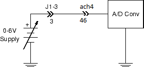

# Experiment 3.1

## Voltage and Waveform Measurements

### Equipment

* Microphone

### Part A: Basic A/D Conversion

1. Connect the [cable](./figs/daq_cable.jpg) from the DAQ card to J3-1 on the
   rightmost interface module. It should look like this:

    

    
    

2. Plug your [BNC-banana adapter](../misc_images/#banana-adapter) into the 6V
   supply terminals. There is a bump on one side of the adapter to denote which
   prong is connected to ground. Be sure to plug this prong into the black
   terminal of the power supply.

3. Using a BNC patch cable, connect the 6 V supply output to J1-3.

4. Connect J1-3 (pin 3) to A/D channel 4 (pin 46). (The pin numbers correspond
   to the interface section of the breadboard).

    

    
    

    !!! note
        With the function generator and oscilloscope, the ground connection to
        the DAQ card is made automatically. We will not show the DAQ card
        ground in subsequent drawings. 

5.  Download [Basic_ADC.vi](./Basic_ADC.vi) and open in Labview. It should look
    like this:

    

    
    

    !!! note
        Labview programs are called *Virtual Instruments* (or *VIs* for short).

6. Start the instrument by selecting `Run` from the `Operate` menu, or by
   pressing the run button (the small arrow just below the menu bar), or by
   pressing CTRL-R on the keyboard with the cursor over the panel.

7. **Vary the power supply voltage and verify that the displayed value changes.
   Measure the voltage with your DMM and see how the values compare.**

8. Move the BNC patch cable from the 6 V supply to the FGEN output. With a
   second BNC patch cable, connect `CH 1` of the oscilloscope to J1-1.  Connect
   the function generator output (pin 3) to the oscilloscope input (pin 1).

    **Verify that you have the following circuit:**

    

    
    

9. Adjust the function generator to produce a $5 V_{pp}$, 0.5 Hz sine wave.
   Observe the signal on the Basic ADC display and compare with the
   oscilloscope output. Make sure clock rate and sample rate are set to 10.
   **Take a Labview screenshot for your lab report.**

10. Increase the frequency to 1 Hz. Note that due to the reduced number of
    samples per cycle, the sinusoidal shape of the waveform is less smoothly
    defined. **Take a Labview screenshot for your lab report.**

11. Increase the freqency to 10.00 Hz. Observe the resulting display.

12. Explain why a 10 Hz sine wave, when sampled 10 times per second, appears as
    a constant (DC) value on the A/D display. **Take a Labview screenshot for
    your lab report. What does an 11 Hz sine wave look like under the same
    conditions?**

13. Increase the sample and clock rate to 100. Observe the resulting display.
    **Take a Labview screenshot for your lab report. Comment on how the Labview
    waveform changes with increasing sampling and clock rate.**

14. Stop the Basic ADC program by pressing the red `STOP` button.
