# Experiment 3.2

## Writing a Labview Program

If all we could with Labview was to make computer based copies of our
conventional instruments, it would be of limited use. What makes Labview so
valuable is that it is *programmable*. By changing the program a single box
(the Lab PC) can perform the functions of a large collection of instruments,
both conventional and unconventional.

Perhaps the greatest advantage of Labview however, is that it is *user*
programmable: if no instrument is available which meets your requirements, you
can modify an existing one or create an entirely new one.

Our goal for this Experiment will be to measure the resistance of the
thermistor and display the result directly as a temperature reading.  Since the
DAQ card can only measure voltage, our first step is to convert the resistance
to a measurable voltage. As an example of how this could be done, consider the
circuit below:

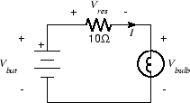

By measuring the voltage drop ($V_{res}$) across the $10\Omega$ resistor we can
compute the current $I$. Since the same current flows in both the resistor and
the bulb, we can compute the resistance of the bulb as $R_{bulb}=V_{bulb}/I$.
If $V_{bat}$ is known, we can determine $V_{res}$ indirectly using KVL:
$V_{res} = V_{bat} - V_{bulb}$.

For our application, we need to replace the light bulb with the thermistor.
Since the thermistor has a much higher resistance, we should also replace the
$10\Omega$ resistor with one closer to the nominal resistance of the
thermistor, in this case $10k\Omega$. In addition, since our goal is to measure
temperature we will need to convert the measured resistance into a displayed
temperature reading.

### Part A: A Very Simple VI

To get started with Laview programming, we will start with the
measurement of a single voltage.

1. Use a BNC-Banana adapter and a BNC patch cable to connect the 0-6 V power
   supply to J1.

2. Wire the following circuit

    

    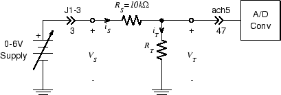
    

    !!! note
        $R_T$ is the thermistor.  Because the thermistor leads are very thin,
        you will probably need to use your needle nose pliers to hold them very
        near the ends in order to insert them into the breadboard without
        bending.

3. Using your DMM, set the $0-6 V$ supply output ($V_S$) to $5.00 V$. Measure
   $V_T$ with your DMM. Since the nominal value of $R_T$ is $10 k\Omega$, it
   should be approximately $2.5 V$. If not, adjust $R_S$ so that the voltage is
   around $2.5 V$.

4. Since we are going to build a VI from scratch, we will start with a new,
   blank VI. Select "New VI" from the "File" menu. A pair of windows should
   appear. The one on top will be a blank Front Panel window and the one on the
   bottom is a blank Block Diagram window.

5. We will first measure $V_T$ and display its value.

6. Right click on the Front Panel window. You will get the Controls popup:

    

    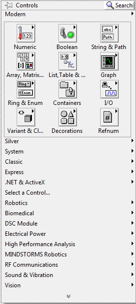
    

    !!! tip
        Place the cursor over the Numeric button and select Numeric Indicator.
        Place this box and left click. The fact that the word "Numeric" is
        highlighted means that it is selected and can be edited. Change the
        name to "VT" by double-clicking.

7. Now we need something for the indicator to display. Click on the Block
   Diagram window to bring it to the top. Note that placing the indicator on
   the front panel has also placed a block on the block diagram.

    

    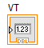
    

    !!! note
        This block is the *icon* associated with the indicator. We can provide
        values for it to display by connecting it to a signal source. The
        source we will use will be one of the A/D converter inputs.

8. Right-click on the Block Diagram window to bring up the Functions palette.

    

    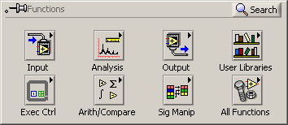
    

9. From the Functions popup, select Express $\rightarrow$ Input $\rightarrow$
   DAQ Assist.

    

    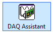
    

10. Position this somewhere to the left of the Graph indicator block and left
    click.

11. After a second or two the "Create New .." wizard will appear.

    

    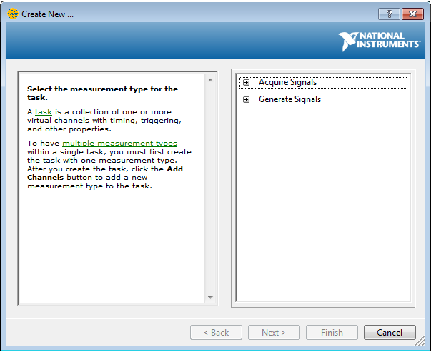
    

12. Click on "Acquire Signals" in the righthand column, then click on "Analog
    Input" then on "Voltage" in the list that appears.

    

    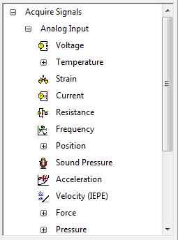
    

13. From the list of Supported Physical Channels that appears, select "ai5",
    then click the "Finish" button at the bottom of the frame.

    

    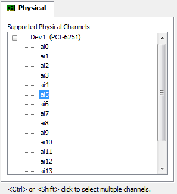
    

14. After another brief wait, the "DAQ Assistant" dialog appears. In the "Input
    Range" block set "Max" to 10 Volts and "Min" to -10 Volts. Set the
    "Acquisition Mode" to "1 Sample (On Demand)". The panel should look like
    this when you are done.  Click the "OK" button when you're done.

    

    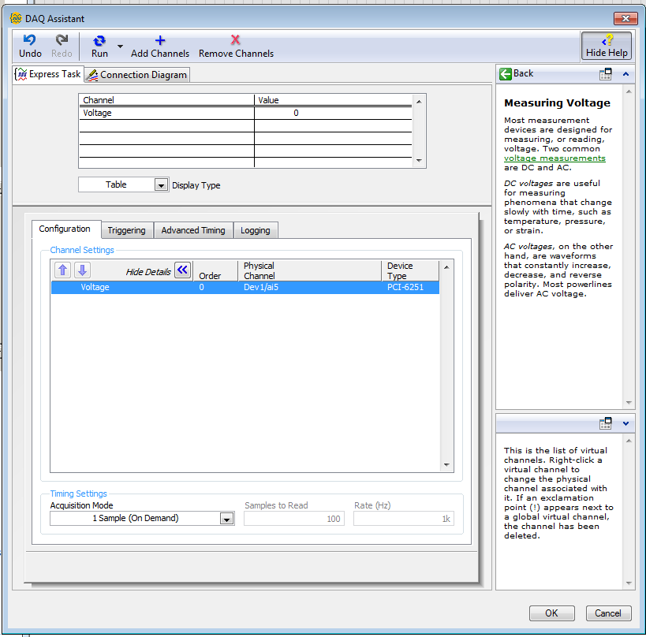
    

15. Things will click and whir for several seconds. When it's all over, the
    "DAQ Assistant" box will have expanded, and should have a white band with
    the word "data" in it.

    

    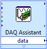
    

16. We're almost done. All that remains is to connect the source (A/D converter
    block) to the destination (numeric indicator block).

17. Place the cursor over the small black triangle in the "data" field of the
    DAQ Assistant block. It should change into an icon representing a small
    spool of wire. Left click once and move the cursor to the small white
    triangle in the center of the left edge of the numeric indicator icon and
    left click once more. That completes our first Labview program.  It should
    look something like this:

    

    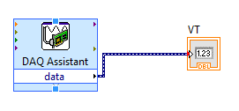
    

    

    
    

#### Data Types

Notice that the color of the icon for the waveform graph changed from orange to
blue. This is an indication that the type of data which it is displaying has
changed. Like many programming languages (e.g. C) Labview maintains the notion
of *data types*. Labview's data types include familiar ones such as integer,
floating point, boolean, and string, as well as a number of unfamiliar ones
(which we will try to avoid for the time being). Labview denotes data type by
the color of the wire which carries it: integer wires are blue, floating point
wires are orange, boolean wires are green, and strings are pink. Labview also
supports collection types, such as arrays and structures. Scalars are denoted
by thin solid lines, arrays by thick solid lines, and other collections by
various patterned lines. The wide dark blue lines with internal dashes are a
composite data type called *dynamic data*.

Dynamic data contains a lot of information in addition to the value of the
sample, for example, the time at which the sample was taken, whether any errors
were made in previous handling of the sample, etc. This means that when we
connect our signal to the waveform display, it can automatically display the
correct time scale on the x-axis, rather than just the sample number.

1. Click on the Front Panel window to bring it to the top. Run the VI by
   clicking on the Run arrow or by typing Ctrl-R. The `VT` nemeric indicator
   should display the voltage across $R_T$, which should still be about $2.5 V$

2. Select `Save As...` from the `File` menu. Set the `Save in:` field to an
   appropriate directory (i.e., your user directory).

    !!! note
        Always set the destination directory when saving a VI. Never try to
        save a VI in the default directory.

### Part B: Converting Voltage to Resistance

So far we're no better off than we would have been using the DMM. In fact we're
worse off since all we have is a voltage. The DMM at least can read resistance
directly. But given $V_S$, $V_T$, and Ohm's Law we can calculate resistance,
and computers are very good at calculating things.

There are two ways we could formulate this calculation. We could do it in two
steps, first computing $I_T=I_S=(V_S-V_T)/R_S$, then using Ohm's Law to get
$R_T=V_T/I_T$. Alternately, we could treat the circuit as a voltage divider,
which gives

$$
R_T=\frac{V_T}{V_S-V_T}R_S
$$

Because we will be interested in $I_T$ in a subsequent Experiment, we will use
the first approach.

1. On the front panel, create a new numeric indicator and label it `IT`.

2. In order to compute the current we will have to do some arithmetic on the
   $V_T$ signal. Go to the block diagram window and right-click to get the
   `Functions` palette.  Select Programming $\rightarrow$ Numeric:

    

    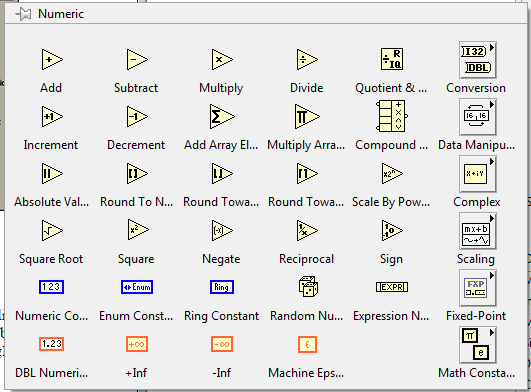
    

3. This has everything we need: subtraction, division, and constants (for $V_S$
   and $R_S$ ).

4. Let's start with the subtraction. Move the cursor over the symbol labeled
   `Subtract` and left click. Position the icon below the existing components
   on the diagram and left click to put it down. Note that while the cursor is
   over the symbol there are three small circles near the vertices of the
   triangle.

    

    
    

    !!! note
        These indicate the connection points and will disappear when the cursor
        moves away.

5. Repeat the above process, but select the `Divide` symbol. Place it slightly
   to the right and a little lower than the subtract icon.

6. Now let's do the constants, starting with $V_S$. Select Numeric Constant
   from the Numeric palette and place the resulting block above and to the left
   of the subtract icon. The highlighted text indicates that you can enter a
   new value. Type `5` and press `Enter` or click the check box at the upper
   left of the window. Repeat this process, placing the icon for $R_S$ below
   and to the right of the divide icon. Enter a value of 10000. Here's what you
   should have at this point:

    

    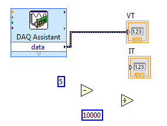
    

7. All that remains is to make the connections. Wire the blocks together
   appropriately. A couple of things to note:

    !!! note
        * The position of the terminals on the arithmetic blocks corresponds to
        the conventions of grade school arithmetic. For subtract the minuend is
        on top and the subtrahend is on the bottom.For divide the dividend is
        on top and the divisor on the bottom.
        * To connect to an existing wire (in this case the one between the A/D
        converter block and the `VT` display block), move the cursor *near*,
        but not directly on, the wire. If you place the cursor on the wire it
        will turn into an arrow, indicating that you can select the wire.

8. When you're done it should look something like this:

    

    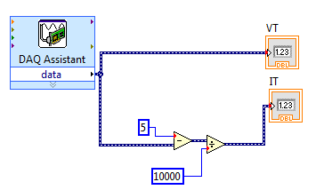
    

9. Let's test what we have so far. Go to the front panel and click on the `Run`
   button. If all is well, $V_T$ should still be about 2.5 V and $I_T$ should
   be about 0.00025 A.

10. Now that we have found the current in the thermistor, finding the
    resistance is easy: just divide $V_T$ (which we measured directly) by $I_T$
    (which we just computed).  To do this we need to add another numeric
    indicator to the front panel and a divide block to the block diagram. Let's
    put the indicator to the right of the two existing ones (and label it `RT`.

    

    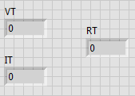
    

11. On the block diagram, place another divide block to the left of the `RT`
    indicator block. Wire it up so that $R_T=V_T/I_T$ and here's what we have:

    

    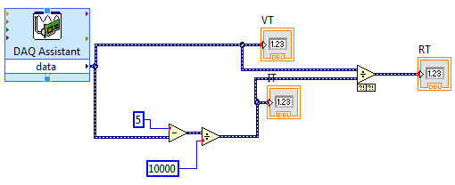
    

12. Test the VI by clicking `Run` from the front panel. The `RT` indicator
    should display a value close to 10000.

### Part C: Converting R to T

Given this value of the resistance and the information on the [thermistor data
sheet](https://na.industrial.panasonic.com/sites/default/pidsa/files/downloads/files/series_ert-d_pdn_03.15.08.pdf),
we can calculate the temperature.

1. Based on the information in the thermistor data sheet, derive a formula
   which gives the temperature (your choice of $K, ^\circ C,$ or $^\circ F$) in terms of the
   resistance of the thermistor.

2. We could perform this computation the same way we did for resistance, by
   using a numeric operation block for each addition, division, etc. in the
   formula, but for a formula like this there is a more efficient and compact
   approach, the *formula node*.

3. In the Block Diagram window, right click to bring up the `Functions`
   palette. Move the cursor to Programming $\rightarrow$ Structures. Click on
   the `Formula Node` button.

4. The formula node is a variable sized block, so it is instantiated by
   clicking on the desired location of the upper right corner and dragging to
   create the desired size. Move the cursor to a convenient spot on the block
   diagram, preferably near the `RT` indicator icon, then click, drag, and
   release to create the formula node. It should look like this:

    

    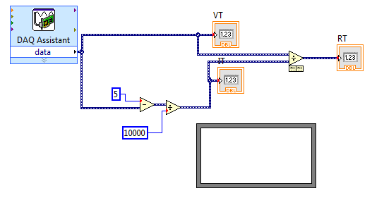
    

    !!! tip
        If you want to find out more about the components in the
        block diagram, you can turn on the *Context Help* feature: select
        `Show Context Help` from the `Help` menu. When context help is turned
        on, a window (labeled `Context Help`) appears in the upper right corner
        of the screen. When the cursor is moved over any component in the block
        diagram, a brief description and a link to additional information
        appears.

5. Let's start with the formula. As an example, we'll use
   $T=300\frac{10000}{RT}$. (If you got this formula, you should check your
   derivation, as it is not correct.) Since we can't type subscripts in
   labview, we will use $RT$ in place of $R_T$. To enter this into the formula
   node, simply place the cursor inside the block, right click, and start
   typing. The formula node uses the C language syntax, and each statement must
   end with a semicolon; When you have finished, click on the check box (or
   anywhere outside the formula node box).

6. At this point you may have noticed a change in the appearance of the
   toolbar: the run button has changed from a white arrow to a gray broken
   arrow ( 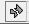 ). This means that there is an error
   in the block diagram and the VI won't run. To find out what the error is,
   click on the broken arrow button.

    If you do this you should find that the problem is an undefined variable.
    Actually, there are two: $T$ and $RT$ . We will define these in the next step
    when we create the input and output terminals.  

7. Place the cursor somewhere on the left-hand border of the formula node and
   right-click. Select `Add Input` from the popup menu. This should create a
   small rectangular box in the border. The highlighted (black) interior of the
   box is a selected text field. Type `RT` and click the check box. Repeat this
   process on the right-hand border, but select `Add Output` and type `T` into
   the box.

8. The arrow is still broken, but now the error message complains of an
   "unwired input." Let's try to fix that: connect the input (RT) to the wire
   between the division block and the numeric indicator which displays the
   value of $R_T$.

    Unfortunately, this seems to have made things worse. Not only is the arrow
    still broken, but we also have a broken wire. (Broken wires are indicated
    by dashed lines with a red X in the middle.) The error list tells us: "You
    have connected two terminals of different types."

    Dynamic data contains a lot of information in addition to the value of the
    sample, for example, the time at which the sample was taken, whether any
    errors were made in previous handling of the sample, etc. Dynamic data
    usually makes life easer for us by bundling ancillary information along
    with a signal so we don't have to be concerend about carrying it around
    separately, but at the moment it's causing problems. While most blocks
    (e.g. subtract, divide, numeric indicator) can accept any appropriate data
    type, including dynamic, others are more picky about what they will take.
    For example, the formula node expects ordinary, pure numeric data and
    doesn't know what to do with the additional stuff contained in dynamic
    data. We can fix this by converting the dynamic data to scalar data.

9. Remove the offending broken wire. To do this, place the cursor directly over
   the wire, so that it turns into an arrow, and double click. Press the
   `Delete` key.

10. Right click to bring up the `Functions` palette. Select Express
    $\rightarrow$ Sig Manip button to bring up the Signal Manipulation palette.

    

    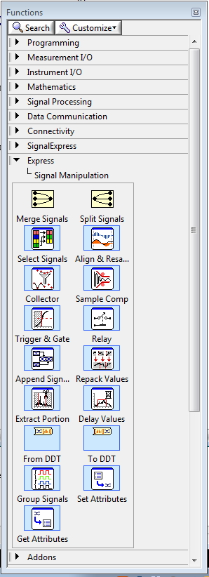
    

11. From this select the `From DDT` block. Place this just to the left of the
    `RT` terminal of the formula node.

12. When you place the `From DDT` block, a dialog box labeled "Configure
    Convert from Dynamic Data" will appear. In the `Resulting data type` field,
    select `Single Scalar`, then click `OK`.

13. Wire the output of the `From DDT` block to the `RT` terminal of the formula
    node. Connect the input of the `From DDT` block to the wire between the
    division block and the `RT` numeric indicator. The arrow should now be
    unbroken.

13. Now display the value of temperature by placing another numeric indicator
    on the front panel and labeling it `T`. Return to the block diagram, and
    wire the new indicator icon to the `T` terminal of the formula node. Here's
    what you should have:

    

    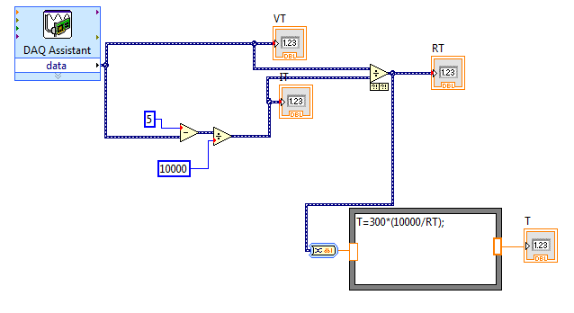
    

14. Return to the front panel and press the run button. The `T` indicator will
    display the current temperature.

### Part D: Continuous Display

Although we have technically achieved our goal of measuring and displaying
temperature, we can only do so on demand. It would be much more useful if we
had a system which could continuously display the current temperature.
Fortunately, this is a simple enhancement to make.  Like more conventional
programming languages, Labview has looping and branching constructs. What we
need here is the *while loop* which repeats its contents until an exit
condition is met.

1. Right click in the block diagram to bring up the `Functions` palette.
   Select Structures. Click on the `While Loop` button.

    

    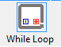
    

2. This is a variable sized block, like the formula node, and we want it to
   enclose everything we currently have in our VI. Click on the panel, and
   enclose your entire block diagram with the while loop.

    !!! note
        Note the green-bordered block labeled `stop` in the lower right corner
        of the while loop. This is a free accessory that allows us to stop the
        loop, which would otherwise run forever. This block is an example of a
        *control*. A control is the dual of an indicator, i.e. it provides
        input from the front panel to the block diagram. Go to the front panel
        and notice that there is a new object, a button labeled `STOP`.
        Pressing this button causes the associated icon to output a True value
        (when the button is not pressed, the output is False).

3. From the front panel, press the `Run` button. The indicators should now
   display continuously updated values. To convince yourself that these aren't
   random, grab the body of the thermistor between your thumb and forefinger,
   being careful not to touch the leads. The displayed temperature should
   increase. Press the `STOP` button when done.

4. The updating of the display, while certainly continuous, might be too fast
   to read. This is because new samples are being taken and displayed as fast
   as the A/D converter is able to take them (1,250,000 samples/second), which
   is much faster than any phenomenon we might bring into the lab is capable of
   changing its temperature. The net result is wasted processor power and a
   blurry display which is difficult to read.

    There are a number of ways in which we can set the sampling rate to a more
    reasonable value. We will utilize one which requires minimal change to what
    we have already constructed.

5. Return to the block diagram and go to Functions $\rightarrow$ Programming
   $\rightarrow$ Timing.  Select the `Time Delay` block

    

    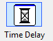
    

    and place it in a convenient location inside the while loop. Accept the
    default delay of 1 second by clicking `OK` in the `Configure Time Delay`
    dialog box. (If the block automatically wires itself to something, remove
    the resulting wire.)

6. Return to the front panel and click `Run`. The display should now update at
   a more leisurely rate.

7. Be sure to include a screenshot of your block diagram in your lab writeup.

8. Save your work as we will make further enhancements to this program next
   week.
