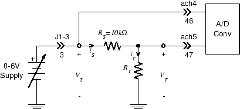
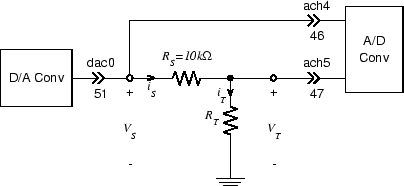

# Experiment 4.2

## Improved Resistance Measurement

Let's apply our new Labview skills to the task of improving the
resistance/temperature measurement system we built last week.

### Part A: Measure Vs

One shortcoming of last week's system is that we have to be careful to set the
power supply voltage to the correct value. Since $V_S$ appears in the formula
for temperature, if this voltage is incorrect, the temperature reading will be
incorrect. A much better design would be to have Labview measure the actual
value of $V_S$ and use that value in the formula.

1. Restore the connections you had in Experiment 3.2 last week with the 0-6 V
   output of the power supply (set to 5.00 V) connected to J1-3.  Check that
   the circuit on your breadboard is still wired correctly. Load and run the VI
   you saved last week and verify that it still produces the correct reading
   for temperature. Vary the power supply voltage and observe that the
   temperature reading changes in response.

2. Stop the VI. On your breadboard, add a wire to connect $V_S$ to `ach4`, so
   that your circuit looks like this:

    

    
    

3. We are now asking the A/D converter to read two different voltages
   simultaneously. This is not a problem for the A/D converter, but it does
   require *us* to figure out how Labview represents multiple simultaneous
   samples.

4. The obvious way to handle this would be to simply add another A/D block and
   set it to A/D Channel 4. If you try this, you will get a cryptic error
   message to the effect that the device is already in use.  This is because
   all of the channels are on the same card, and the first channel which is
   opened has exclusive use of the device. Labview handles this by combing
   multiple samples into a *vector*, with one entry for each channel.

5. Double click the A/D block or select `Properties` from the menu. This will
   bring up the `DAQ Assistant` dialog. Click on Add Channels button near the
   top of the panel
    
    

    
    

6. Select `Voltage` from the popup menu, then select `ai4` from the list of
   Supported Physical Channels. A new entry for ai4 should appear in the
   channels list. Because channel 5 appears first on the list, it will be the
   first element of the vector of samples and channel 4 will be the second. It
   won't cause problems as long as we remember the order. Click `OK`.

7. The block diagram looks the same as before, but now the wire is carrying two
   separate values. Perhaps surprisingly, this fact does not change the
   original operation of the VI. Subsequent blocks, expecting a single value,
   simply take the first element of the vector. Since we left the original
   signal ($V_T$) as the first element, everything to the right of the A/D
   converter block works as it did before. Start the VI and verify that this is
   the case.

8. Click on the wire segment coming out of the `data` terminal of the `DAQ
   Assistant` block and press `Delete` to remove it. The remainder of the wire
   will become broken, since there is now no input. From the `Functions`
   palette, select Express $\rightarrow$ Sig Manip $\rightarrow$ Split Signals.  Place the
   resulting icon between the A/D converter output and the leftmost portion of
   the broken wire, and click to release.

9. The split signals block is expandable to accomodate the number of signals in
   a bundle. Place the cursor over the middle of the bottom edge and move it
   around until it turns into a resize arrow. Drag the bottom edge down by one
   increment. The resulting icon will look like a wishbone in a box.

    

    
    

10. Wire the left side of the split signals block to the A/D output. The upper
    output is $V_T$ (ach5).  Connect it to the broken $V_T$ wire.

11. The lower output is $V_S$ , which will replace the constant value of 5
    currently connected to the upper input of the subtract block. Delete this
    numeric constant block and wire the lower output of the split signal block
    to its previous destination.

12. Start the VI and verify that the displayed temperature value is still
    correct. Vary the value of $V_S$ and verify that it remains correct.

### Part B: Generate $V$s in Labview

Our temperature measurement system is now more accurate, but it's still very
bulky since it requires the power supply in order to function. In the previous
Experiment we were able to use Labview to generate constant voltages. If we
were to generate such a voltage and connect it in place of the power supply, we
would have a self-contained measurement system.

1. Stop the VI. On your breadboard, remove the wire connecting J1-3 to $V_S$
   and replace it with a wire connecting `dac0` to $V_S$.

2. On the block diagram, move the bottom edge of the while loop down to create
   room for additional components. In the resulting space add a `DAQ Assist`
   output block, selecting `Analog Output`, `Voltage`, `ao0`, and `1 Sample (On
   Demand)` as before. To the left of this block, place a numeric constant, set
   its value to 5, and wire it to the D/A block input.

3. Start the VI and verify that all is well.

### Part C: Smoothing

You have probably noticed that the displayed temperature is not very steady.
This is due to undesired signals, or *noise*, finding their way into our
system.

Much of what we will do in subsequent Labs, will be devoted to minimizing the
effect of noise. For now we will content ourselves with the most common
response to unwanted variation in data: taking the average.

Before we start to improve the situation, let's try to get a
quantitative idea of how bad it is. At the moment what we know is that
the displayed value jumps around a lot. Let's get a picture of those
jumps.

1. Stop the VI and go to the front panel. Right click to bring up the
   `Controls` palette, go to Graph $\rightarrow$ Waveform Chart. Place the
   resulting chart in a convenient location on the front panel.

2. Use `Find Terminal` or your own navigational skills to find the icon for the
   `Waveform Chart` on the block diagram. Connect its input to the `T` output
   of the formula node.

3. Return to the front panel and start the VI. The chart will provide a graphic
   record of the variations in the temperature reading. Accumulate a few
   seconds of readings, then stop the VI and take a screenshot of the front
   panel.

4. Right click to bring up the `Functions` palette, select Sound and Vibration
   $\rightarrow$ Data Evaluation $\rightarrow$ Probability and Statistics
   $\rightarrow$ Statistics. Place the resulting block between the `DAQ
   Assistant` block and the split signals block. When the `Configure
   Statistics` dialog appears, select `Arithmetic mean`, then click `OK`.
   Connect the output of the `DAQ Assistant` block to the `Signals` input of
   the `Statistics` block. Connect the `Arithmetic Mean` output to the input of
   the split signals block.

5. If we were to run the VI at this point, we would get the same behavior as
   before. This shouldn't be surprising, since the average of a single value
   (the `1 Sample` from the A/D converter) is just the original value. What we
   need to do is take the average of a large number of input values to produce
   a single output.

6. Double click on the `DAQ Assistant` block to bring up the configuration
   dialog. Under `Acquisition Mode`, change `1 Sample (On Demand)` to `N
   Samples`. Set `Samples To Read` to 1000. Since the `Rate` is 1000 samples
   per second, this will give us 1000 values to average. Click `OK`.

7. Since the process of gathering the 1000 samples now consumes one second, the
   `Time Delay` block is no longer needed. Either delete it, or edit it and set
   the delay to zero.

8. Return to the front panel and start the VI. The signal on the `Waveform
   Chart` should be much smoother. In fact we might be willing to believe that
   the variations that remain correspond to actual changes in temperature.
   Screenshot to compare with the unsmoothed plot.

9. Stop the VI and save it in a persistent location.

### Part D: Measure Illumination

Having spent considerable effort developing a system for accurately measuring
temperature, we would like to leverage this technology into new market areas.
Since this technology is based on the measurement of resistance, we can use it
to measure any physical phenomenon for which we have a resistance based
transducer. A quick search of our parts kit turns up an ideal candidate for
this new venture: the CdS photocell.

1. In the circuit from the previous Part, replace the thermistor with your CdS
   photocell.

2. Make a copy of the VI you used in the previous part and give it an
   appropriate name. Load this VI and go to the block diagram.

3. Based on the information in the CdS photocell
   [datasheet](https://media.digikey.com/pdf/Data%20Sheets/Photonic%20Detetectors%20Inc%20PDFs/PDV-P9001.pdf)
   , **derive a formula which gives the illumination level (in Lux) in terms of
   the resistance.**

4. Replace the formula in the formula node of the block diagram with the one
   you derived in the previous step. On the front panel, change the label of
   the temperature display from `T` to `Illumination`.

5. Since light can vary much more rapidly than temperature, the `Waveform
   Chart` display would be more useful with a faster update rate.  Edit the A/D
   converter block and change the `Samples To Read` from 1000 to 100.

6. Start the VI and verify that it works correctly.

7. **Determine the illumination level under various conditions: under-shelf
   light on or off, smart phone light on or off, photocell covered, or even
   movement around the photocell, etc.** If necessary, clear the plot by
   right-clicking over the display window and selecting "Clear Chart".

8. Set the VirtualBench function generator to produce a 1 Hz, 8 $V_{ pp }$
   square wave. Use BNC clip leads to connect a red LED to the output.(polarity
   is not important). The LED should be flashing at a rate of once per second.

9. Hold the LED over the photocell, pointing downward. Observe the resulting
   waveform on the `Waveform Chart` display. Increase the distance between the
   LED and the photocell and **note the maximum distance** at which the signal
   from the LED is still discernable in the displayed waveform.

This last step provides an example of an optical communication system where the
signal delivered to the LED is transfered over an optical channel to emerge
some distance away as the output of the photocell.  This is essentially the
same arrangement we used in Part C of Experiment 2.3, except we're using the
photocell instead of the photodiode.

The response of the photodiode is much faster than that of the photocell, but
we found that its output voltage was a distorted version of the optical input.
The reason for this: viewed as a *current* source the photodiode's output is
linear in the input irradiance, while viewed as a *voltage* source its output
is logarithmic. We will deal with this next week by building a circuit which
converts this output current to a voltage.
