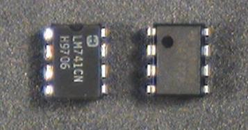
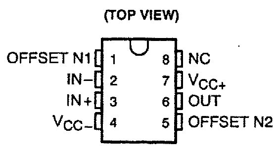
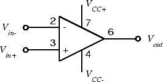
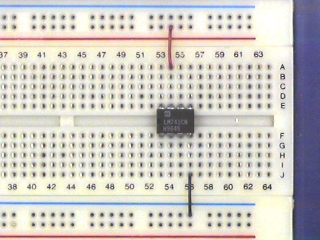
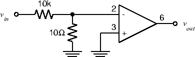

# Experiment 5.1

## The 741 Op-Amp

### Components

* 741 Op Amp
* Resistors: 1-10 $\Omega$, 1-10 $k\Omega$

The 741 operational amplifier, or op-amp, comes in an 8-pin dual inline package
(DIP) which looks like this

If you look closely at the package, you will find a notch at one end or a dot
in one corner. This tells us how to find Pin 1: the dot is located next to
Pin 1 and the notch is located between Pins 1 and 8. The rest of the pins are
numbered like this:

Pin 8 is not connected (NC). Pins 1 and 5 are used to eliminate the offset
voltage. We won't be using this feature this week, so don't connect anything to
these pins. The remaining pins give us the following circuit symbol for our
op-amp:

For more information, see the [741 data
sheet](http://www.ti.com/lit/ds/symlink/lm741.pdf).

In order to function, the op-amp must be connected to an external *power
supply*. Since we want to produce both positive and negative output voltages,
we need both positive and negative voltages for the power supply. These are
labeled $V_{CC+}$ and $V_{CC-}$ on the diagram. For a 741, the nominal values
are $V_{CC+} =15 V$ and $V_{CC-} = 15 V$.

To avoid clutter, we won't show the power supply terminals (pins 4 and 7) on
any of the subsequent circuit diagrams. However, they must be connected or your
amplifier will not operate.

Note that there is no ground terminal on the op-amp. The zero reference point
is established by the external circuit and is not important to the op-amp
itself.

### Part A: Powering up the Op-Amp

1. If you have not already done so, wire the bus strips on your breadboard (as
   described in the [wiring](../references/wiring) section) to provide positive
   power, negative power and ground buses.

2. Plug an op-amp into the breadboard so that it straddles the gap between the
   top and bottom sections of the socket strip. If you have wired the power
   buses as suggested above, Pin 1 should be to the left.

    !!! warning
        Do not try to unplug the op-amp with your thumb and forefinger. It's a
        good way to end up with the op-amp plugged into your fingertip. Use the
        pliers or [IC puller](../misc_images/#ic-puller) from your toolkit.

3. Connect Pin 4 ($V_{CC-}$ ) to the negative power supply bus (-15 V). Connect
   Pin 7 ($V_{CC+}$ ) to the positive power supply bus (+15 V).

    

    
    

4. With the power supply off, adjust the $+25V$ supply to $15V$ and $-25V$ to
   $-15V$.

5. Connect the negative power supply to the black banana jack on your
   breadboard, the positive power supply to the red breadboard banana jack, and
   the common (arrow) terminal to the green breadboard banana jack. The common
   terminal must now be grounded, so use a fourth banana plug cable to connect
   the common terminal to the ground terminal on the power supply dongle.

### Part B: Open-Loop Response

    !!! caution
        The components we've used so far have been simple (only two terminals)
        and fairly rugged (connecting a resistor "backwards" won't harm it).
        The op-amp has four times as many pins, so it's easier to make a
        mistake in wiring it. Unfortunately, it's also considerably more
        delicate, so connecting it incorrectly can destroy it.

        The moral: Always wire your circuit with the power turned off and check
        your wiring carefully before turning the power on.

1. With the power turned off, wire the following circuit. Note that this is a
   1000:1 voltage divider, so that a 1 V signal at $v_{in}$ results in a 1 mV
   signal at the input of the op-amp.

    

    
    

2. In the experiments below we will see the shortcomings of a real (as opposed
   to an ideal) operational amplifier. **As you go through the experiments
   below, explain in your report which experiments demonstrate the following:**
   (1) clipping, which limits the maximum amplitude of the output; (2)
   slew-rate limitation, which limits the maximum slope of the output; (3)
   offset, which gives a non-zero output for zero input.

3. Set the function generator to produce a $2 V_{pp}$, 20 Hz sine wave.

4. Connect the function generator output to $v_{in}$ of the circuit above.
   Connect `CH1` of the scope to $v_{in}$ and `CH2` to $v_{out}$ . Make sure
   both channels of the scope are on `DC`.

5. You should see a badly distorted (clipped) waveform at $v_{out}$ . If you
   don't, try increasing the function generator output.**Take a screenshot for
   your lab report and note your vin value. Why is the output distorted?**

6. Adjust DC offset on the function generator until the waveform is roughly a
   symmetrical square wave. **Note the positive and negative peak values of
   $v_{out}$. What is the DC offset value that was required to get symmetrical
   output?**

7. Connect a 100$\Omega$ resistor from $v_{out}$ to ground.  **What happens to
   the output signal?**

8. Remove the 100$\Omega$ resistor from the op-amp output. Set the function
   generator output to square wave. **Note the shape of the $v_{out}$ waveform.
   Is the output able to switch as fast as the fast-switching square wave
   input?**

9. Set the function generator to produce a 1 kHz sine wave. Adjust the
   amplitude and DC offset until the op-amp output is a 10 V p-p unclipped sine
   wave. **Note the amplitude of the function generator output. Can you
   estimate the open-loop gain of your opamp? Is it consistent with the
   specifications in the data sheet? (Look up the large signal voltage gain).**

10. When we reduce the overall gain with feedback, some of these (e.g.  offset)
    are reduced significantly, and we get an output which is an amplified
    version of the input. However, other limits (such as maximum output)
    appear.
