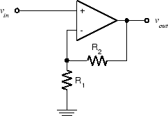
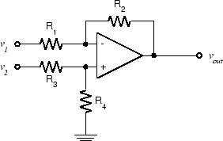

# Experiment 5.2

## Voltage Amplifiers

### Components

* 741 Op Amp
* Resistors: 1-100 $\Omega$, 2-10 $k\Omega$, 1-100 $k\Omega$

As we saw in the previous experiment, the op-amp isn't very useful in an
"open-loop" configuration (i.e. without feedback). The most common
configuration for op-amp circuits is the *inverting amplifier* where the output
is an amplified and inverted version of the input (i.e.  $A$ is negative). From
this starting point we can create a number of different input-output
relationships, including sum, difference, and non-inverted gain.

### Part A: The Basic Inverting Amplifier

1. Wire the following circuit using 10 k$\Omega$ resistors for both $R_1$ and
   $R_F$.

    

    
    

2. Set the function generator to produce a 1 $V_{pp}$, 100 Hz sine wave.
   **Measure the voltage gain**, $A_v = \frac{V_{out}}{V_{in}}$ using the
   oscilloscope. Note that the output is inverted with respect to the input.

3. Replace $R_F$ with a 100 k$\Omega$ resistor.  **Measure the gain.**

4. Increase the input amplitude until output clipping occurs. **What is the
   clipping level? Is it the same as in Exp. 5.1?**

5. Reduce the input amplitude till the output is 20 $V_{pp}$. Then increase the
   frequency until the output amplitude drops to 10 $V_{pp}$. You should see a
   triangular output waveform. This is because there is a limit to the maximum
   rate at which the output voltage can change, called the *slew rate.*

6. Set the input to triangle and square wave and **comment on how the output
   changes.**

7. Reset the function generator for a 100 Hz sine wave and reduce the amplitude
   to produce a 1 $V_{pp}$ output from the op amp.

8. Again increase the frequency until the output is 0.7 $V_{pp}$. Observe that
   the output is still sinusoidal. **Note the frequency.** This is called the
   cutoff frequency or *bandwidth* of the amplifier.

### Part B: Summing Amplifier

There are a number of applications where it is useful to produce the sum, or
more generally the weighted sum, of two or more signals. One example is the
mixer system in a recording or broadcast studio where various sources
(microphones, audio files, etc.) are combined to produce the final mix for the
track or program.

The inverting amplifier configuration we used makes this very easy to do, just
add another resistor to the inverting (-) input of the op amp:

A quick analysis shows that $v_{out} = -(\frac{R_F}{R_1}v_1 +
\frac{R_F}{R_2}v_2)$ , i.e.  the output is a weighted sum of the inputs. The
key is to notice that the current flowing in $R_F$ must be (by KCL) equal to
the sum of the currents in $R_1$ and $R_2$ . For this reason, the node of an op
amp circuit which is connected to the inverting input is sometimes referred to
as the *summing junction*. This summation can be extended to any number of
inputs.

1. Rather than just add two arbitrary signals together and watch the result on
   the oscilloscope, let's do something a bit more entertaining: add two
   signals together and listen to them. From our observations in Part A of
   Experiment 2.2 and Part A of this Experiment, we would expect to have
   trouble driving the loudspeaker with the output of the op-amp.  Fortunately,
   we have a more suitable acoustic output transducer: the earpiece of the
   telephone handset. The telephone earpiece is also very easy to connect to:
   just plug it into J1-7 and wire to the appropriate pins on the interface
   module connector strip. Notice that, unlike the microphone, neither of the
   two earpiece terminals is automatically grounded. Be sure to ground one and
   connect the other to $v_{out}$.

2. For our two inputs, we will use the function generator for $v_1$ and the
   dynamic microphone for $v_2$ . The earpiece produces a comfortably loud
   output with a signal of about 1 V p-p. This is a level easy to produce with
   the function generator, so we will choose a gain of 1 from $v_1$ to $v_out$
   . This means we must choose $R_1=R_F$ , but says nothing about the actual
   value. From past experience, 100 kΩ is a good choice. **Choose the value of
   $R_2$ required to give a 1 V p-p output when speaking into the microphone in
   a normal tone of voice.** (Hint: Plug in your microphone into J1-4, and view
   pin 4 on your oscilloscope to see the approximate peak-to-peak output when
   you speak into the microphone. Then calculate the gain required to get 1-V
   output. Size R2 based on this).

3. Build the circuit using the component values you determined in the previous
   step. Connect $v_1$ , $v_2$ , and $v_{out}$ appropriately (function
   generator, microphone, handset). Also connect $v_{out}$ to the oscilloscope.
   When the circuit is completed, speak into the microphone at a normal
   speaking level and **verify that the output $v_{mic}$ is approximately
   1 V p-p.**

4. Set the function generator to produce a 440 Hz sine wave (musical note A).
   Adjust the amplitude to produce a comfortable listening level in the handset
   earpiece. While listening to the earpiece and watching the oscilloscope, hum
   the note A. **Take a screenshot and describe what happens on the scope when
   you are in tune and when you are slightly out of tune with the function
   generator.** If the range of your voice does not encompass A440, try tuning
   the function generator down an octave to 220 Hz.

### Part C: Non-Inverting Amplifier

So far all of the op-amp circuits we have examined have been *inverting*, i.e.
the polarity of the output is inverted with respect to the input. This doesn't
have to be the case, as the following circuit shows:

This is an example of the basic *non-inverting* op-amp configuration. A simple
analysis shows that $v_{out}=(1+\frac{R_2}{R_1})v_{in}$ (with no minus sign).
This circuit has a couple of useful characteristics. Most obvious is that it
doesn't invert. Another is that the input impedance is extremely high. One
potential disadvantage is that the minimum value of gain is unity.

1. Using another 741 op amp, wire the non-inverting amplifier circuit.  Let
   $R_1$ be 1 $k\Omega$. Choose $R_2$ to give a gain of 2.

2. Connect a 1 $V_{pp}$ 1 kHz sine wave to $v_{in}$ . Observe $v_{in}$ and
   $v_{out}$ on the oscilloscope.

3. **Take a screenshot. What is the actual gain? Is it in non-inverting?**

### Part D: Difference Amplifier

What if we want the difference, rather than the sum of two signals? We could
combine an inverting amplifier with a summing amplifier to negate one of the
signals before forming a sum, but this would require two op-amps. A simpler
circuit results from combining an inverting and a non-inverting configuration
on the same op-amp, like this:

For arbitrary values of the resistors, we get 

$$
v_{out}=-\frac{R_2}{R_1}v_1+\frac{R_4}{R_3+R_4}\frac{R_1+R_2}{R_1}v_2
$$

which doesn't seem very useful. However, if we let $R_3=R_1$ and $R_4=R_2$,
then we have 

$$
v_{out}=\frac{R_2}{R_1}(v_2-v_1)
$$ 

i.e. a *difference amplifier*.

1. Wire the above circuit, using 10 $k\Omega$ for all four resistors.

2. Using the function generator for $v_1$ and the 0-6 V power supply for $v_2$,
   **take a screenshot and verify that $v_{out}$ is indeed the difference of
   $v_1$ and $v_2$ with the expected sign.**
