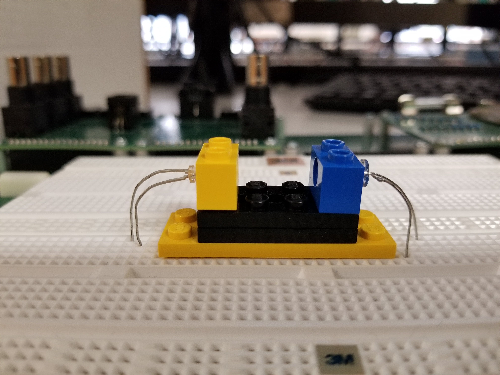
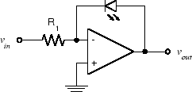
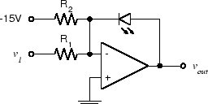
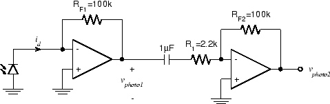

# Experiment 6.1

## Transducer Amplifiers

### Equipment

* Test board
* Red LED
* Photodiode
* Lego pieces - (2) 1x2 beams, (1) 2x4, (2) 1x2 plates (see below for pics)
* 3 LM741 opamps
* 100$\Omega$, 10$\Omega$, 1.5$k\Omega$, 2 100$k\Omega$, 2.2$k\Omega$

Transducers are devices that convert a physical quantity into an electric
signal, or vice versa. Photodiodes and LEDs belong to the class of transducers.
We tried connecting these devices directly to our measuring instruments in
Experiments 1.2 and 2.4 with less than ideal results. The reason for this is
their performance is based on current rather than voltage or resistance. We
don't have current sources available to drive the LED and our current measuring
equipment is not sensitive enough to produce useful readings from the
photodiode.

In this Experiment, we will use op-amps to produce a pair of hybrid amplifiers.
One is an amplifier which accepts a current as an input and produces a voltage
as an output. Quantitatively we can express this as $v_{out}=R_mi_{in}$ where
$R_m$ is the gain of the amplifier. $R_m$ is called the *mutual resistance* or
more commonly *transresistance* (short for "transfer resistance"). Similarly a
*transconductance* amplifier will convert an input voltage $v_{in}$ to an
output current $i_{out}$.

There is a variety of applications for either a transresistance amplified
photodiode or a transconductance amplified LED. A further set of applications
is opened up by combining the two into an *emitter-detector pair*. We saw one
such application in Lab 2 where we built a miniature optical communication
system using an LED as a transmitter and a photodiode as the receiver. In a
communication system we want to maximize the achievable distance between
transmitter and receiver and our main concern about the space between them is
that it cause as little attenuation to the transmitted signal as possible.

Another class of applications precisely fixes the transmitter and receiver and
attempts to deduce information about the material between them by measuring the
attenuation. Any actual information transmitted is purely incidental.

Today we will assemble the components into a convenient, mechanically stable
package and provide additional circuitry to improve the linearity and
sensitivity of the resulting emitter-detector pair.

### Part A: An Emitter-Detector Pair

For a communication system, portability of the transmitter and receiver is
important. However, many of the measurement systems based on optical
emitter-detector pairs require a precisely fixed distance between the
transmitter and receiver. Our first step will be to build the mechanical
structure to house our emitter and detector.

We will use Legos to create our mechanical structure. Use the [1x2
beam](./figs/1x2beam.jpg), to mount the photodiodes and LEDs. We will be using
a high-brightness red LED in this experiment.

1. Press the LED into the hole in a 1x2 beam. The leads should be arranged
   parallel to the long axis of the block:

    

    
    

    !!! tip
        If the photodiode is a bit too small to fit into the Lego hole, cut a
        strip of paper and wrap around the photodiode before inserting into the
        block.
        

        
        

2. For convenience we will mount the entire assembly on the breadboard, so use
   a 2x4 plate as the base and use [1x2 plates](./figs/1x2plate.jpg) for
   vertical height.  
    

    
    
    

3. Bend the leads of the photodiode and LED downward and twist each pair by
   $45^\circ$. Position the assembly in the center of the breadboard with the
   LED on the left and plug in the leads.
    

    
    

We now have an optical path, of length approximately equal to three times the
basic Lego pitch, with an LED at one end and a photodiode at the other. This
will be our basic apparatus for transmission measurements.

### Part B: Photodiode Amplifier

The inverting op-amp circuit works by taking the current that flows into the
"virtual ground" at the inverting input and forcing it to flow in the feedback
resistor. Since the voltage across $R_F$ is equal to $R_F I_F$ , the output
voltage (on the other terminal of $R_F$ ) is proportional to the current
flowing into the virtual ground. What if instead of this current originating
from the voltage across $R_1$ , it instead came directly from a current source?
Well, the output voltage would still be proportional to it: $v_{out} = -R_F I_F
= -R_F I_{in}$ I.e. we have an amplifier which accepts a current as an input
and produces a voltage as an output.  This is called a *transresistance
amplifier*. (Since a resistance converts its current to a voltage ($v=Ri$ ), a
transresistance converts a current in one part of the circuit to a voltage in
another.)

1. Wire up the photodiode amplifier shown above near the photodiode.  Leave
   enough space to the right of this circuit for an additional op-amp.

2. Turn on the under-shelf florescent lamp and monitor $v_{out}$ with the
   oscilloscope. You should see a DC value with a significant amount of 120 Hz
   ripple. **Take a screenshot.**

### Part C: LED Driver

If we drive the LED directly from the function generator (as we did in Lab 2)
the resulting optical signal is badly distorted since the LED only conducts on
the positive half-cycle of the waveform. We can fix this problem by using the
`OFFSET` control to add a DC *bias* to the signal. If the bias is greater than
the amplitude of the AC component, the signal is always positive and the LED
will always conduct. However, there is still some distortion due to the
exponential i-v relationship of the diode. Since the brightness of the LED is
proportional to current and our signal sources put out voltages, we need a
voltage-in, current-out or *transconductance* amplifier.

Some background before constructing: the simplest way to get a transconductance
amplifier out of our basic inverting amplifier configuration is to replace the
feedback resistor with the element whose current we wish to control, in this
case the LED:

To get the offset we need to avoid clipping, we can add a second input and
connect it to one of the power supplies. In this case, to forward bias the
diode, we must connect it to the negative (-15 V) supply.

Thirdly, we would like to be able to monitor the current in the LED. To do this
we simply add a current sensing resistor in series.

Putting this all together we get the following:

1. Wire the circuit as shown above to the left of the LED in the
   emitter-detector pair.

2. Set the function generator to produce a 1 V p-p, 1 Hz square wave and
   connect it to $v_{drive}$ . The LED should get brighter and dimmer, but
   never be completely extinguished.

3. While observing both $v_1$ and the photodiode amplifier output on the
   oscilloscope, **determine the maximum value $v_{drive}$ can have before
   distortion occurs.**

4. Analyze the above circuit and **determine the relationship between
   $v_{drive}$ and $i_{LED}$. What is the quiescent current in the LED (i.e.
   with no input signal)?**

### Part D: More Gain for the Photodiode

With nothing but air between the LED and the photodiode, our photodiode
amplifier gives a satisfactory output. However if we want to be able to measure
objects with high optical density, we will need more sensitivity. Since the
output voltage is determined by the product of the photodiode current and
$R_F$, we can get more output for the same input simply by increasing $R_F$.

We could increase the gain by a factor of 100, by replacing $R_F$ with 10 MΩ;
however, there are a couple of reasons not to do it that way. One is that
putting too much gain in a single stage can lead to problems, including reduced
bandwidth. Another is that this would amplify the DC component of the signal
(due to ambient light) by the same amount as our (much smaller) LED signal.
This could cause the amplifier to saturate (clip), causing complete loss of the
desired signal. Adding a second stage, with a DC blocking capacitor between the
stages, eliminates both of these objections.

1. Add additional components to your existing photodiode amplifier to produce
   the circuit above. The additional circuitry should be placed directly to the
   right of the original photodiode amplifier that you built in Part B.

2. Observe $v_{photo2}$ with the oscilloscope. You should see the 120 Hz ripple
   due to the ambient flourescent lighting. With the scope set to DC, there
   should be no significant offset voltage.

3. **Ignoring the effect of the capacitor, what is the total transresistance
   gain ( $v_{photo2}/i_d$ ) for this circuit?** Don't disassemble the
   photodiode amplifier or LED driver circuits. We will be using them in future
   labs.
