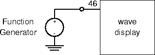
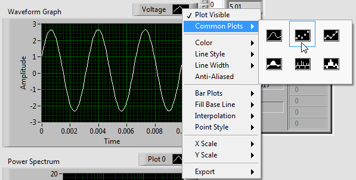
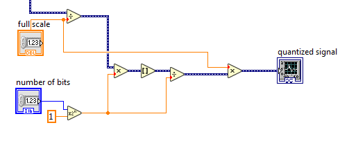
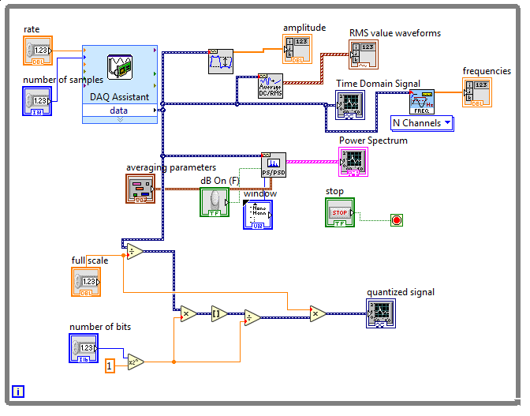

ELEC 240 Lab

------------------------------------------------------------------------

Experiment 7.1
--------------

Sampling and Quantization
-------------------------

### Equipment

* Test board
* Lab PC

### Part A: Sample Rate and Aliasing

When we convert a continuous, analog signal to a digital signal (digitize it),
we *sample* its value at regular intervals. The sequence of numbers that
results represents the original signal at these sample points, but ignores what
goes on between them. If the signal is sufficiently well-behaved (i.e. it
satisfies the Nyquist criterion and contains no energy at frequencies greater
than half the sampling frequency), then these sample points are enough to
represent the original signal exactly. But if the original signal contains a
frequency greater than half the sampling rate, that frequency will be *aliased*
to a lower frequency.  

Let's start by looking at what sampling looks like in the time domain.

1. Connect the function generator output and CH1 of the scope to A/D input4
   (pin 46 on the interface board socket strip).

2. Set the function generator to produce a $5 V_{ pp }$, 300 Hz sine wave.

3. Download the [spectrum analyzer](./labview/Lab7_Spectrum_Analyzer.vi) and
   open in Labview. Set "number of samples per channel" and "rate" to 10000.
   Set "averaging mode" to RMS averaging. Start the program by pressing the run
   button or by pressing CTRL-R with the cursor over the window.

    !!! note
        Here's what we have:

        

        
        

6. Right-click on the black box indicating waveform type above the Signal
   waveform, which says Dev1/ai4. Select Common Plots and select the 2nd option
   (points only). You should see about three cycles of a sine wave displayed in
   the waveform graph. Unlike last week's display, the samples are shown as
   individual dots, rather than connected line segments.

    

    
    

7. Slowly increase the frequency to 2 kHz and note how the waveform becomes
   less clear.

8. At 2 kHz, press `STOP`. You should see either several lines or several
   overlapping sine waves. This is an illusion caused by the fact that only a
   few samples of each cycle are being taken. **How many samples are being
   taken per cycle? Take a screenshot.**

10. To see the actual underlying waveform more clearly, switch the display to a
    continuous line style from the "Common Plots" submenu.

11. Restart the program and continue increasing the frequency of the function
    generator until you reach 5 kHz, stopping at several points along the way
    to examine the waveform. When the function generator frequency is exactly
    half the sampling frequency the samples will alternate the same positive
    and negative values. (This may be easier to see by switching to the
    vertical line plot display style.)

12. Add a fundamental frequency indicator (Frequency.vi) to your block diagram
    to display the frequency numerically.

13. Continue increasing the function generator frequency. Notice that as you
    approach 10 kHz, you begin to see a well-defined sine wave which
    *decreases* in frequency as you increase the function generator frequency.
    This is the *alias* of the generator frequency. At exactly 10 kHz you
    should get a zero frequency sine wave.

14. Continue increasing the function generator frequency past 10 kHz. Note that
    you once again have a sine wave that increases in frequency as the input
    frequency increases. **Do the input frequency and displayed frequency
    match? Pick two input frequencies to comment on.**

15. **Explain the concept of aliasing, folding, and the Nyquist criterion, and
    relate to your results.**

16. Try square and triangle waves of various frequencies and comment on what
    happens to them as the frequency changes.

17. Press the `STOP` button and exit the waveform view program.

### Part B: Amplitude Quantization

Once the input signal has been sampled, it must be represented as a number in
the computer. Since there are a limited number of bits available to encode the
number (12 in this case), there are only a limited number of values that can be
exactly represented. Values in between two successive encodings must be rounded
or truncated to one or the other. This process of forcing the continuous input
range into a discrete set of values is called *quantization*.

1. Let's add a quantizer to our spectrum analyzer VI. Add the following blocks
   and connections to your VI. See the note below for the locations of function
   blocks.

    

    
    

    !!! note
        All function blocks are found under Express $\rightarrow$ Arithmetic
        and Comparison $\rightarrow$ Express Numeric. The above function blocks
        include Divide, Multiply, Round to Nearest (indicated by square
        brackets) and Scale by Power of 2 ($\alpha 2^n$).

2. Connect the data signal to the leftmost Divide block, so that the full block
   diagram looks like this:

    

    
    

3. On the left hand side of the spectrum analyzer are two controls which
   control the quantization of the sampled signal. The *full scale* control
   sets the maximum allowed bits of the signal. The number of bits control sets
   the *number of bits* that may be represented within the allowed range. Set
   the *full scale* to 12 and experiment with higher and lower *number of
   bits*. **What do you notice in the waveform display?**

4. Change the input to the PS/PSD block to be the quantized signal instead of
   the signal coming from the DAQ cable. **How does the spectrum change with
   quantization?**

5. Change the input to the PS/PSD block back to be the signal coming from the
   DAQ.

6. Stop and exit the VI.
