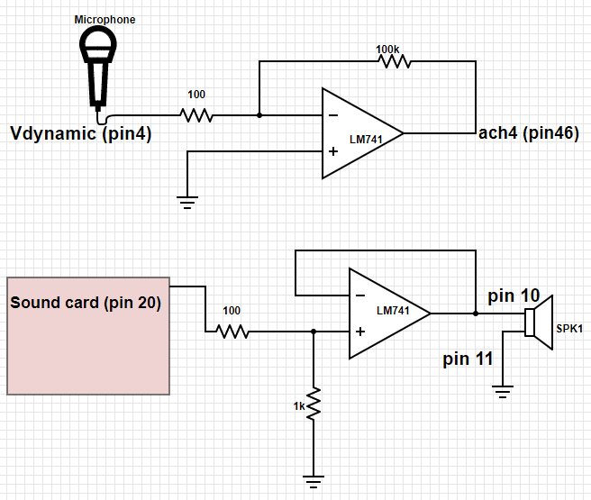

ELEC 240 Lab

------------------------------------------------------------------------

Experiment 7.2
--------------

The first step in batch processing is to record the input signal as a disk
file. We will use a Labview program to do this, then use Matlab to do the
signal processing itself.

### Equipment

* Telephone handset
* Dynamic microphone
* Test board
* A musical instrument if you have one!

### Part A: Digital Recording

1. Connect the cable from the DAQ card to J3-1 on the rightmost interface
   module. Plug the sound card cable into J2-1. Plug the phone handset into
   J1-7.

2. Build the following two circuits. The top one will be used to amplify and
   record your voice via the dynamic microphone, and the bottom one will play
   back audio from the computer to the phone handset.

    <center>
    
    </center>

3. Verify that the audio output is working by playing this [test
   signal.](./signals/sine.au)

4. Download [Recorder](./labview/Recorder.vi) and open in Labview. This program
   will record four seconds of a signal to a file.

5. Make sure Dev1 is selected as your device name. Start the program by
   pressing the Run button or CTRL-R.

6. When ready to record, press the `START RECORDING` button. Wait for the green
   indicator to come on and speak a significant phrase (e.g. "My labbies are so
   great") into the microphone. You should see the signal on the waveform chart
   as it is being recorded.

7. After four seconds a window will pop up asking you to save the signal to a
   file. Save it as `sig1.tdms`. The default location will be in the C drive
   under folder Temp.

8. Navigate to the saved file and right-click on the file. Select Open With
   $\rightarrow$  Excel Importer.

9. Go to the sheet called Untitled. You will see the sampled data in the sheet
   called Untitled. Note that the samples have been scaled so that their value
   corresponds to the signal value in volts. Save the excel file as `sig1.xlsx`
   and close.

10. Make a second recording of whistling a tune, playing your flute, or some
    other sequence of tones with a "simple" harmonic structure. Or play a pure
    tone via your smart phone (find an app or search on youtube).  Save this as
    `sig2.xlsx`.

### Part B: Loading the Signals into Matlab

1. Load Matlab from the Start menu by following the All Programs  $\rightarrow$
   Matlab  $\rightarrow$  Matlab R2017a. (You could also transfer the files to
   your laptop and work with Matlab on your own computer.)

Our signals were recorded with a sampling rate of 10 kHz. We can save a
little typing by defining a Matlab variable for the sampling frequency:

```matlab
Fs=10000; 
```

Select the button "Import Data". Navigate to the data location and double-click
on the file `sig1.xlsx`. Select the Untitled sheet. Rename Column B (default is
Voltage) as `sig1`. Click on Import Selection.  

You should now have a table of values named something like "sig1S1". Convert it
from a table to an array of values with the command:

```matlab
sig1=table2array(sig1S1)
```

Play it back by typing the following command: 

```matlab
sound(sig1, Fs)
```

**What happens if you reduce `Fs` by half?** 

Repeat steps 3 and 4 for your second signal (sig2). 

### Part C: Spectral Analysis 

Display the spectrogram of your signal: 

```matlab
specgram(sig1, 256, Fs);
```

The number n=256 in the above command is the length of the signal chunk used in
computing the Fourier transform. For our sample rate of 10 kHz, **what is the
time resolution (n/fs)? What is the frequency resolution (fs/n)?**

We can get finer resolution in time or frequency (but not both at the same
time) by decreasing or increasing this number. Try values of 128 and 512 and
**comment on what difference they make in the spectrogram.** With 512 you
should be able to see the individual harmonics of the pitch frequency. If you
have a low pitched voice, you may be able to see the individual pitch pulses
with length 128. Can you distinguish the voiced from the unvoiced sounds?

**What are the time and frequency resolutions corresponding to these transform
lengths?**

!!! tip
    The `figure()` command allows you to display several plots or spectrograms
    at one time

```matlab
figure(2)
specgram(sig1, 128, Fs)
```

will create a new plot window (Figure 2) and display the new spectrogram in it.
To go back to Figure 1, just type `figure(1)`. The spectrogram is simply a
concatenation of the spectra of individual chunks of the signal, which we can
compute individually. Use the time scale on the spectrogram to find a strong
voiced region of the signal (say, for example at $t=1.5s$). Since the sampling
rate is 10 kHz, this corresponds to a sample index of $t*10000$ ($15000$ in our
example). Extract a chunk of length 256 from the signal at this point: 

```matlab
chunk=sig1(15000:15255);
```

Examine your chunk with the plot command: 

```matlab
plot(chunk) 
```

Now take the DFT of this chunk of the signal: 

```matlab
spectrum = fft(chunk);
```

Let's first try to plot the spectrum in the 'obvious' way:

```matlab
plot(spectrum)
```

The result is not what we expected! The spectrum is a complex valued sequence,
and Matlab plots complex functions as the real vs. imaginary part. A more
satisfying picture can be had with: 

```matlab
 plot(abs(spectrum));
```

Note that this plots both positive and negative frequencies. To get a more
traditional plot: 

```matlab
 plot(abs(spectrum(1:129)));
```

Can you see the shape of this curve in the spectrogram at the point where you
took your chunk? The spectrogram uses a logarithmic scale for magnitude, so you
might try one of the following:

```matlab
plot(log(abs(spectrum(1:129))));
```

```matlab
semilogy(abs(spectrum(1:129)));
``` 

**Take a screenshot.**

Display the spectrogram of your musical signal.

```matlab
specgram(sig2, 256, Fs);
```

**Can you identify the individual notes in the tune?** Different instruments
have different harmonic structures: a flute has few harmonics, an oboe or
trumpet has many, a clarinet has no even harmonics. **Analyze the harmonic
structure of your tones.**
