# Experiment 8.1

## Digital Logic

### Equipment

* Test board
* $1\times$ 74HC00 Quad 2-input NAND gate
* $1\times$ 7486 Quad 2-input XOR gate
* $2\times$ LEDs
* $1\times$ Quad DIP switch
* $5\times$ $330 \Omega$ resistors

### Part A: Understanding the Components

Let’s understand the components we will be working with.

#### LED

An LED is a light-emitting-diode, or p-n junction diode. It has an anode pin
(the longer one), which should be connected to the higher voltage, and a
cathode pin (the shorter one), connected to a lower voltage.  Current only
flows from anode to cathode, which causes it to light up.

#### Quad DIP Switch

The quad DIP (Dual-In-Line Package) switch used here is a package with four
switches inside. Each switch has two statuses. When a switch is turned off (at
the lower position), the two ends of it are isolated.  When it is turned on,
the two ends are shorted.

#### 7400 (74HC00) NAND gate

A NAND gate performs the function NOT AND. The circuit symbol looks like this:

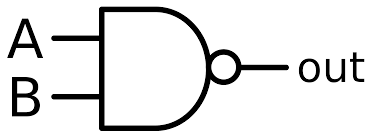

But let’s first understand the AND function, whose circuit symbol looks like
this:

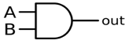

If you AND inputs $A$ and $B$, the output will be true only if both $A$ *and* $B$ are
true. With two inputs, you have four possible combinations possible: $A$ and $B$
are both false; $A$ is false while $B$ is true; $A$ is true while $B$ is false; or $A$
and $B$ are both true.

A NAND gate inverts the result of an AND operation. So while an AND operation
only outputs true when both $A$ and $B$ are true, a NAND operation will output
true for all combinations *except* when both $A$ and $B$ are true. This
information is compiled in a truth table which looks like this, where true is 1
and false is 0:

| A | B | A NAND B |
|---|---|----------|
| 0 | 0 | 1 |
| 0 | 1 | 1 |
| 1 | 0 | 1 |
| 1 | 1 | 0 |

As you can see, the NAND gate looks like an AND gate but with a bubble on the
end. This bubble is the symbol for the NOT (or inverter) operation. The inside
of the NAND IC that we are going to use looks like this:

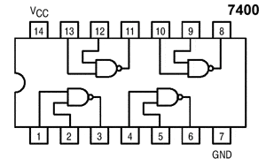

It contains four independent NAND gates, and a pin for $V_{cc}$ ($+5V$) and a
pin for GND $(0V)$. When an output is true, the voltage on the output pin will be
$+5V$, and $0V$ when false.

#### 7486 (74HC86) XOR gate

The XOR gate is performs the EXCLUSIVE OR operation. In other words, the output
is true only when exclusively $A$ or exclusively $B$ is true. See the truth
table below for an XOR operation:

| A | B | A XOR B |
|---|---|---------|
| 0 | 0 | 0 |
| 0 | 1 | 1 |
| 1 | 0 | 1 |
| 1 | 1 | 0 |

The XOR IC we will use has the following pin diagram. Notice the circuit symbol
for an XOR gate:

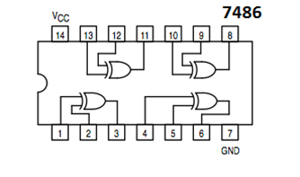

Other common logic gates are NOT (inverse of input), OR (either $A$ or $B$ (or
both) are true), NOR (not OR), and XNOR (inverse of XOR). Based on what you’ve
learned about truth tables from the previous operations, **fill in the truth
table below:**

|$x$|$y$|NOT $x$|$x$ OR $y$|$x$ NOR $y$|$x$ XNOR $y$|
|---|---|-------|----------|-------- --|------------|
|0  |0  |       |          |           |            |
|0  |1  |       |          |           |            |
|1  |0  |       |          |           |            |
|1  |1  |       |          |           |            |

!!! note
    All the logic ICs we are using should be supplied with a $+5V$ DC voltage for
    $V_{cc}$.

### Part B: The Full-Adder Circuit

The binary adder circuit is an important building block of digital arithmetic
circuits. Its purpose is to form the arithmetic sum of two binary numbers. In
this lab, we will be building a one-bit full-adder, which adds two 1-bit binary
numbers as well as a carry bit. The result will be a 1-bit sum and a 1-bit
carry term. In this section we will see how to design a binary adder out of
basic logic gates.

Let's first understand a little more about the binary system. Binary is
calculated in base 2. If we have $n$ input bits, we have $2^n$ possible
combinations, and can represent up to the decimal value $2^n-1$, starting
with decimal value 0. In our case, we have three 1-bit inputs, so we have
$2^n = 8$ possible input combinations.

To understand binary addition, let's look at an example. The steps are similar
to a decimal summation. For example if we are adding $1101$ and $0110$, we sum
up the column beginning at right, and carry over the extra to the next column.
A carry bit results when there are 2 or more 1's in the input. The sum
$1101+0110=10011$ is written as shown below.

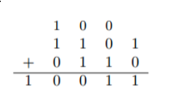

As you can see, a multi-bit summation can be computed with several individual
addition steps. Each step adds up one column of three 1-bit numbers and
provides a carry to the next column. (For the first column on the right, the
carry could be filled in as a zero).

A circuit for this one-column adder is the one that we will build in this lab.

Let's represent the two 1-bit inputs as $x$ and $y$, the carry as $z$, and the
two outputs as sum bit $S$, and the final carry bit $C$. The truth table is
below.

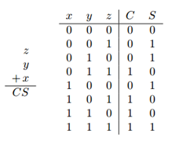

To build a logic circuit, we want to formulate a single logical expression
whose result matches the truth table for all cases of input combinations. Since
we have two outputs $S$ and $C$, we need two logical expressions.

!!! note
    Instead of indicating logical operations with the gate name (i.e., $x$ XOR
    $y$) there are common symbols that are used in logical expressions to
    indicate the logical operation. Given two inputs $x$ and $y$:

    | Name | Symbolic Expression |
    |------|---------------------|
    | $x$ AND $y$ | $xy$ or $x \bullet y$|
    | $x$ OR $y$ | $x \vee y$ |
    | NOT $x$ | $\lnot x$ |
    | $x$ NAND $y$ | $\lnot ( x \bullet y )$ |
    | $x$ NOR $y$ | $\lnot ( x \vee y )$ |
    | $x$ XOR $y$ | $x \bigoplus y$ |
    | $x$ XNOR $y$ | $\lnot (x\bigoplus y)$ |

Let's start with formulating an expression for output $S$. Redraw the full adder
truth table and add two additional columns, labeling one as $x \bigoplus y$ and
the other as $(x \bigoplus y) \bigoplus z$. **Fill in the new columns of your
truth table and show that**

$$
S = (x \bigoplus y) \bigoplus z
$$

| $x$ | $y$ | $z$ | $x\bigoplus y$ | $\left( x\bigoplus y \right)\bigoplus z$ | C | S |
|-----|-----|-----|----------------|------------------------------------------|---|---|
| 0   | 0   | 0   |                |                                          | 0 | 0 |
| 0   | 0   | 1   |                |                                          | 0 | 1 |
| 0   | 1   | 0   |                |                                          | 0 | 1 |
| 0   | 1   | 1   |                |                                          | 1 | 0 |
| 1   | 0   | 0   |                |                                          | 0 | 1 |
| 1   | 0   | 1   |                |                                          | 1 | 0 |
| 1   | 1   | 0   |                |                                          | 1 | 0 |
| 1   | 1   | 1   |                |                                          | 1 | 1 |

**Similarly, show that the output $C = (x \bullet y) \vee (x \bigoplus y) \bullet z$**.

From our expressions, it looks like the output $S$ will require two XOR gates,
and $C$ will require additional 2 ANDs and an OR. A circuit diagram for this is
shown below.

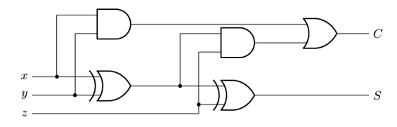

However, building this circuit will require using three different ICs, two of
which we don’t have.

So now we will apply a very useful law called DeMorgan's Law to our
expressions, which states:

$$
\begin{aligned}
x \bullet y &= \lnot (x \vee y) \\
x \vee y &= \lnot (x \bullet y) 
\end{aligned}
$$

DeMorgan's Law implies that any AND gate can be substituted with an OR and a
NOT gate, and vice versa: any OR gate can be substituted with an AND and a NOT
gate. Applying DeMorgan's Law to the expression for $C$ and using some
simplification steps, we see that $C$ could be obtained with just NAND and XOR
gates: 

$$
C = \lnot 
        \left( 
            \lnot (x \bullet y) \bullet \lnot 
                \left( 
                \left(x \bigoplus y \right) \bullet z 
                \right) 
        \right)
$$

**Create a truth table to prove this to yourself.** The circuit for this
equation is below:

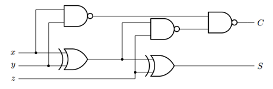

### Part C: Constructing the Full-Adder

Let’s build this full-adder on our breadboard.

1.  Place the DIP switch on your breadboard, and set all the switches to the
    off position. Let switch 1 (SW1) be x, SW2 be y, and SW3 be z.  Wire the
    following connections to each of your switches as shown below. The pins on
    the side of the off position should be wired to ground. The 330-Ω resistor
    acts to prevent a short between power supply and ground when the switch is
    closed. TTL (transistor-transistor logic) indicates where you will make the
    connection to your logic gates in Step 4.

    

    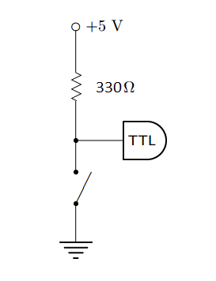
    

2.  Next, insert the NAND IC (74HC00) and XOR IC (74HC86) on your breadboard,
    checking that the notches on the ICs both face the same direction.
    
    

    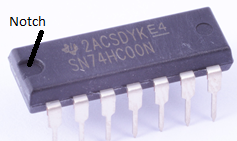
    

3.  Wire $V_{cc}$ and GND for the two ICs, where $V_{cc} = 5V$.

4.  Wire the logic circuit together with the pin assignments as shown
    below:

    

    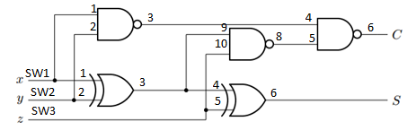
    

5.  We want to include some indicator of what our Sum and Carry output is. For
    this we will use LEDs, that will light up when the output is 1. Wire the
    following connections to your S and C outputs. (The resistor in series
    avoids excessive voltage drop across the LED).

    

    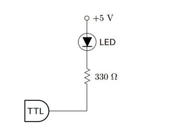
    

6.  Your full-adder is done! Now test if it works, by checking all possible
    input combinations from your full-adder truth table. **Take a photo for
    each input combination (showing switch and LEDs) to include in your
    report.**

7.  Output the adder's sum to the computer using the breadboard.  Fire up
    Labview and create a digital display of the sum.
