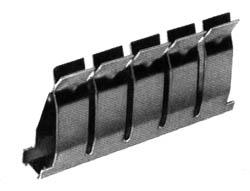
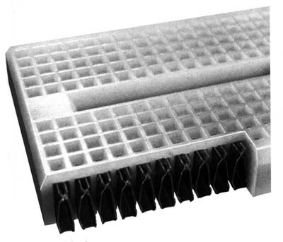
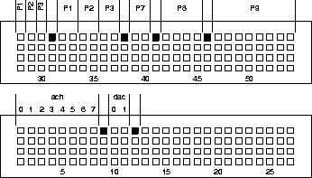
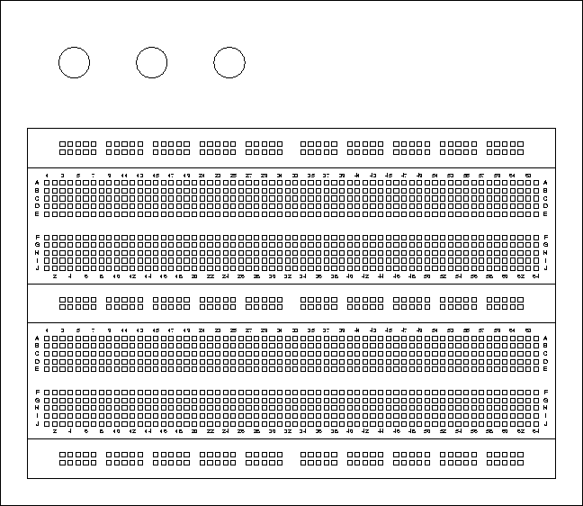
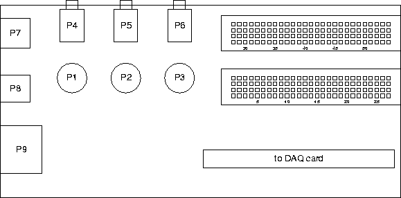

ELEC 243 Lab

------------------------------------------------------------------------

The Breadboard
==============

### The Concept

When building a "permanent circuit" the components can be "grown" together (as
in an integrated circuit), soldered together (as on a printed circuit board),
or held together by screws and clamps (as in house wiring). In lab, we want
something that is easy to assemble and easy to change. We also want something
that can be used with the same components that "real" circuits use. Most of
these components have pieces of wire or metal tabs sticking out of them to form
their terminals.

### How it Works

The heart of the solderless breadboard is a small metal clip that looks like
this:

Each of the pairs of fingers is mechanically independent from the others, so we
can insert the end of a wire between any pair without reducing the tension in
any of the other fingers. However when we insert a wire between any pair, we
electrically connect all metal fingers together.

To make a breadboard, an array of these clips is embedded in a plastic block
which holds them in place and insulates them from each other, like this:

Depending on the size and arrangement of the clips, we get either a socket
strip or a bus strip. The socket strip is used for connecting components
together. It has two rows of short (5 contact) clips arranged one above
another, like this:

The bus strip is used to distribute power and ground voltages through the
circuit. It has has six long (24 contact) clips arranged lengthwise, like this:

Note that the bus strip is not electrically connected in the center. If you
want a single, continuous bus, you will have to bridge that central gap
yourself.

When we combine two socket strips, three bus strips, power connectors, power
tie points, interface modules, and an interface connector on a large printed
circuit board, we get the complete breadboard:

(In this picture we have replaced the plastic covers, hiding the connection
between the terminal points).

The breadboard lets us connect components together and by wiring the bus strips
to the binding posts and the binding posts to the power supply, to connect the
power supply to the circuit. Now what we need is a way to bring connections
from the rest of the instruments into the breadboard.
