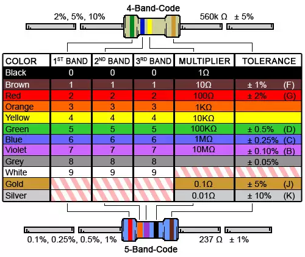

# Resistor Color Codes

## Resistor Color Code Calculators
 
* [Digikey](http://www.digikey.com/en/resources/conversion-calculators/conversion-calculator-resistor-color-code-4-band)
* [UPenn](http://www.ee.upenn.edu/rca/res/calcjs.html) 
* [EEWeb](http://www.eeweb.com/toolbox/4-band-resistor-calculator) 
* [Hobby Hour](http://www.hobby-hour.com/electronics/resistorcalculator.php)
