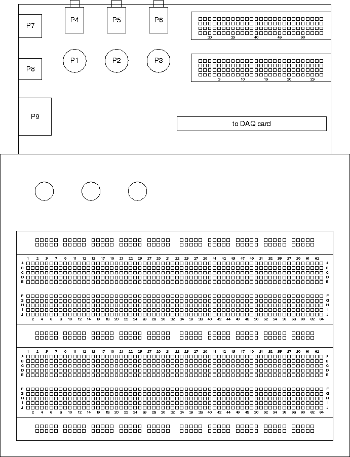
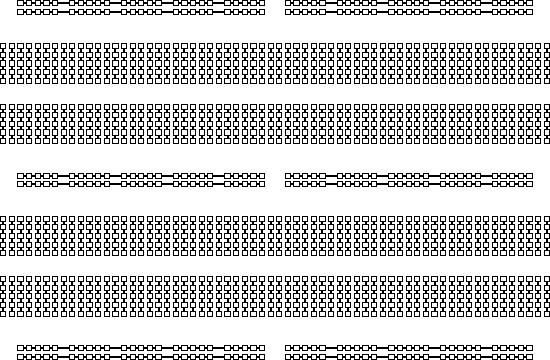

# Pin Connections and the Interface Module

The path from the instruments to the breadboard is provided by the
*Interface Module*. This is a printed circuit board with a variety of
different connectors and two short, single-row socket strips.

These are like the socket strips on the breadboard (five points connected
together) except that instead of being connected just to themselves, the pins
are also connected to the other connectors on the board.

Here's a closeup of the two halves of the socket strip (shown separately to fit
the page better):

### Pin Connections

Here's a table of what each breadboard pin is connected to:

------------------------------------------------------------------------

| **Pin** | **Signal** | **Function** | **Pin** | **Signal** | **Function** | 
| --- | ------ | -------- | --- | ------ | -------- |
| 1   | bnc1 | J1-1 BNC 1 | 28 | nc | No connection | 
| 2   | bnc2 | J1-2 BNC 2 | 29 | Rx | receiver | 
| 3   | bnc3 | J1-3 BNC 3 | 30 | nc | No connection | 
| 4   | ph1l | J1-4 Phone Plug 1 left | 31 | nc | No connection | 
| 5   | ph1r | J1-4 Phone Plug 1 right | 32 | nc | No connection | 
| 6   | ph2l | J1-5 Phone Plug 2 left | 33 | nc | No connection | 
| 7   | ph2r | J1-5 Phone Plug 2 right | 34 | nc | No connection | 
| 8   | ph3l | J1-6 Phone Plug 3 left | 35 | nc | No connection | 
| 9   | ph3r | J1-6 Phone Plug 3 right | 36 | nc | No connection | 
| 10  | ear1 | J1-7 Handset earpiece | 37 | nc | No connection | 
| 11  | ear2 | J1-7 Handset earpiece | 38 | nc | No connection | 
| 12  | mic1 | J1-7 Handset microphone | 39 | Tx | transmitter | 
| 13  | mic2 | J1-7 Handset microphone | 40 | nc | No connection | 
| 14  | gnd | Ground | 41 | gnd | Ground | 
| 15  | sound_mic | J2-1  microphone | 42 | ach0 | input0 | 
| 16  | sound_spkrl | J2-1 speaker left | 43 | ach1 | input1 | 
| 17  | sound_spkrr | J2-1 speaker right | 44 | ach2 | input2 | 
| 18  | sound_lin_inl | J2-1 line in left | 45 | ach3 | input3 | 
| 19  | sound_lin_inr | J2-1 line in right | 46 | ach4 | input4 | 
| 20  | sound_lin_outl | J2-1 line out left | 47 | ach5 | input5 | 
| 21  | sound_lin_outr | J2-1 line out right | 48 | ach6 | input6 | 
| 22  | gnd | Ground | 49 | ach7 | input7 | 
| 23  | ph4l | J2-2 Phone Plug 4 left | 50 | nc | No connection | 
| 24  | ph4r | J2-2 Phone Plug 4 right | 51 | dac0 | output 0 | 
| 25  | bnc1 | J2-3 BNC 4 | 52 | dac1 | output 1 | 
| 26  | bnc2 | J2-4 BNC 5 | 53 | nc | No connection | 
| 27  | bnc3 | J2-5 BNC 6 | 54 | nc | No connection | 

!!! note
    Pins 15-21 are reserved for the PC sound card connection.
