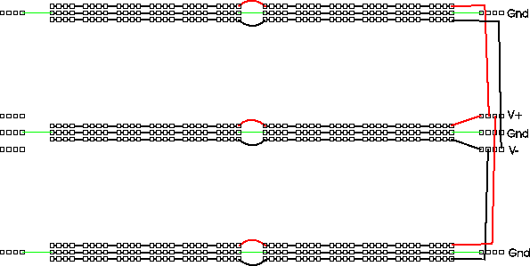
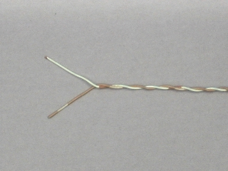
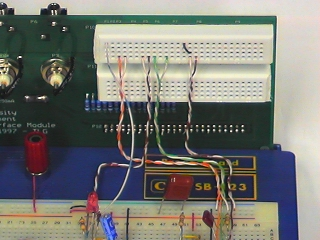
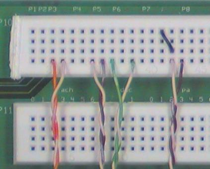
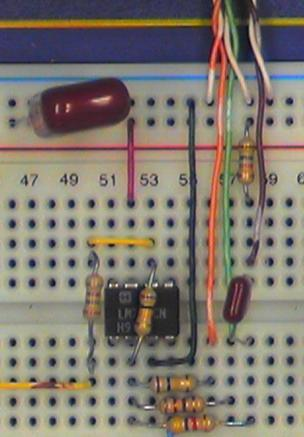

ELEC 240 Lab

------------------------------------------------------------------------

Wiring
======

### Organizing Your Breadboard

The first few Labs are something of a "warmup" in terms of utilizing the
breadboard. We will use only one or two of the interface components at a time
and will build circuits consisting of 2 or 3 components which are disassembled
at the end of lab. As we get closer to the final project, we will be
constructing more complicated circuits having more external connections. Since
some of these will perform functions needed in subsequent Labs, we will want to
leave them in place on the breadboard for future use. We will need a plan for
organizing the layout and wiring on the breadboard and interface board.

There are several aspects to this organization ranging from small details to
the big picture.

#### Color Coding

Your wire kit contains an assortment of different colored wires. You could just
pick pieces of wire at random, or you could try to use the different colors to
designate different signals. There aren't enough colors for each signal to have
its own, but you can use different colors to denote different classes of
signals.

One set of signals you should color code are power and ground. In particular,
you should have a different color for $+15V$, $-15V$, and ground. You should
not use any of these colors for other signals. It would be nice to use
"standard" colors for these, but unfortunately there are several competing
standards. One color that nearly everyone agrees on is that red should be the
positive power supply voltage. Most automotive and electronic wiring uses black
to denote ground. Electronic wiring which uses black for ground often uses blue
for the negative supply. However, our power supply and breadboard use green to
denote ground (the convention used in house wiring) and use black to denote the
negative supply.

So we have two possible "standard" color codes for power: 

1. red = +, green = gnd, black = -
2. red = +, black = gnd, blue = - 

You could use either of these, or make up your own.

Another useful thing to color code would be the wires or "probes" from the
interface board connector. That way you can tell which wire is `CH1` of the
scope or which is the function generator output without having to trace from
one end of the wire to the other.

#### Power Bussing

There are a few different ways to figure out the orientation of an Integrated
Chip (IC) such as an an [op-amp](../misc_images/#741-op-amp).  The first step
is to figure out where pin 1 is. The remaining pins are in chronological order
and increment in a counter-clockwise direction.

If pin 1 is in the lower left corner, then the writing on the package reads
left to right. Alternately, some ICs will have a dot above pin 1.  A third
indication is a semi-circle indentation on the top end of the chip - pin 1 will
be to the left of it.

To simplify power wiring, we should run the positive bus above each socket
strip and the negative bus below. Doing this and running ground on the
remaining buses gives us the following layout for power:

#### Interface Board Connector Assignments

Some of the connectors on the Interface Board are dedicated to a single
function (e.g. the telephone handset or the sound card). Others (e.g.
the BNC and phone jacks) are more flexible and may be connected to a
variety of signal sources or destinations. It will be helpful to
establish standard assignments for these connectors as well.

In the instructions and photographs, we will be using the following
assignment:

------------------------------------------------------------------------

| **Connector** | **Socket Pin** | **Signal** |
| ------------- | -------------- | ---------- |
| J1-1          | 1              | Oscilloscope channel 1 |
| J1-2          | 2              | Oscilloscope channel 2 |
| J1-3          | 3              | Function generator output |

------------------------------------------------------------------------

#### Overall Layout

This final project will be a fairly complex circuit. Good engineering practice
is to break down a complex system into a number of simple subsystems, each of
which performs a single, well-defined function.

In the unlikely event that your circuit does not work perfectly the first time
you turn it on, it will make it easier for you (and your labbie) to debug it if
each of these subcircuits is laid out (neatly, of course) on its own little
patch of breadboard and is connected to the other subcircuits in such a way
that it may be easilly disconnected from them for testing in isolation.

One additional advantage of a tidy layout with short wires is that it is more
rugged. Remember that you will have to transport your circuit from your lab
bench to the testing station without parts falling off or loops of wire getting
caught and mysteriously pulled loose.

### Real World Circuit Problems

On paper all our components are ideal and no components exist where we don't
draw them. In an actual circuit, things are not quite so tidy: wires have non
zero resistance and inductance, sources have output resistance, parasitic
capacitances and mutual inductances exist between wires, and a host of other
gremlins. In addition, although we are only applying input signals up to a few
10s of kHz, the active devices (op amps and transistors) we use have gain at
frequencies up to a few MHz (op amps) or 100s of MHz (transistors). This means
that all of the "little" pieces of wire can become fairly effective antennas,
radiating energy to (and receiving from) the rest of the world, and more
significantly, to other parts of the circuit.

What all this means is that a circuit which is wired correctly topologically
may fail to function as expected. Although we can't eliminate all of these
effects, we can do some things to minimize them.  Here are a few.

#### Layout

Try to arrange your layout so that each function is grouped together in a
single area of the board and so that stages that are connected together are
close to each other. This will allow connections to be made with shorter wires.
Also try to avoid having high level signals near low level stages.

#### Twisted Pairs

One way to reduce unwanted coupling between different signals in your circuit
is to use *twisted pairs*, i.e. a pair of wires twisted together with one wire
connected to ground and the other carrying the signal.

To make a twisted pair, select two wires having an aesthetically pleasing
combination of colors and twist them together.

You could use twisted pair wires for connections between the interface board
and your circuit, as well as any other long runs of wire.

Use one wire for the signal and connect the other to ground, at both ends of
the run.

------------------------------------------------------------------------

------------------------------------------------------------------------

Some signals (e.g. the photodiode input) don't have a ground. In this case, you
can still use a twisted pair, but neither wire will be grounded.

#### Routing

Twisted pair or not, try to keep wires carrying high level signals (large
voltages or currents) (e.g. the LED or earphone) away from those carrying low
level signals (e.g. the photodiode or dynamic microphone).  A corollary to this
is to keep outputs away from inputs, especially in the same subcircuit. It's
better for wires to cross at right angles than to run parallel to each other.

#### Bypass Capacitors

Another path for unwanted coupling between stages is via the power supply. To
reduce this, use some of your electrolytic capacitors as *bypass capacitors*,
i.e. connect them between the power supply voltages and ground (be sure to
observe correct polarity on the electrolytic capacitors - the shorter wire is
usually negative polarity, and you will also see a neg sign above this wire).
Ideally each op amp should be bypassed, but you may be able to get by with a
single pair of capacitors for the entire circuit.

#### Wiring Technique

The basic idea of wiring on a solderless breadboard is simple: just stick the
ends of the component leads or wires into the holes. But like any seemingly
simple process, there are a few subtleties that can make the difference between
success and failure.

First a note of caution. The material that the clips inside the breadboard are
made of (so called "nickel silver") is a compromise between good conductivity,
corrosion resistance, and springiness. In particular the elastic limit is
considerably less than of a good steel spring and if spread too far, can be
permanently distorted. To avoid deforming the connector clips:

- Use only the wire that is supplied to you (24 gauge, solid
  telephone cable).
- Use only components with small diameter leads (1/4 watt resistors,
  capacitors, ICs, etc.).
- Do not insert power resistor leads into the breadboard.  When using power
- transistors in the breadboard, use your pliers to
  twist each lead 90 degrees so that they are gripped by the broad face rather
  than the narrow edge.
- Never insert more than one wire in a hole.

With the health of our breadboard assured, there are a few more things we can
do to make sure that our connections are good ones.

- Strip about 7 mm of insulation from each end of a piece of wire.
  Less than that raises the risk that insulation will be forced between the
  fingers of the clip. More leaves bare wire exposed that can short to adjacent
  components. Don't try to jam the wires far down into the breadboard because
  it can scratch the bottom and damage the connection. One exception: strip
  about 15 mm from the end of a wire that will be clamped in one of the binding
  posts. Make sure copper is showing on both sides of the post when it is
  clamped down.
- When inserting a wire or component, use your needle nosed pliers
  rather than your fingers to hold it. Grip the wire or lead about 10 mm from
  the end and press straight down.
- If the end of a wire becomes kinked, cut it off or use your pliers
  to straighten it.
